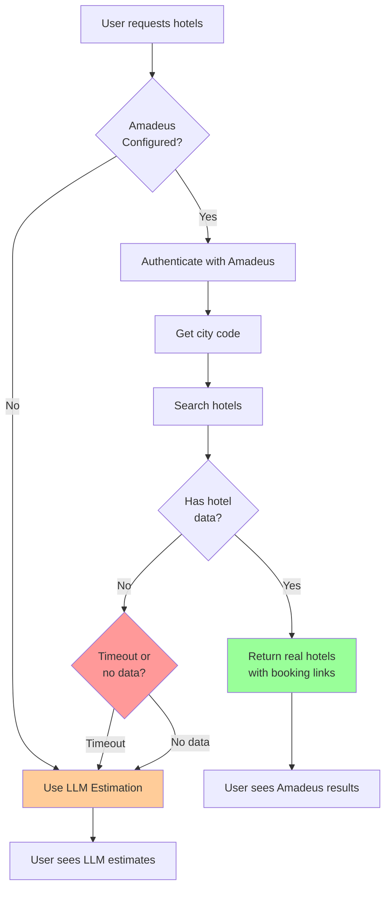

# Amadeus MCP Integration Status

**Date:** 2025-11-22
**Status:** ⚠️ **CONFIGURED BUT LIMITED TEST DATA**

---

## ✅ What's Working

### **1. Amadeus API Credentials** ✅
- Client ID: Configured ✅
- Client Secret: Configured ✅
- Authentication: Working ✅
- Token refresh: Working ✅

### **2. MCP Server Implementation** ✅
- **File:** `mcp_servers/amadeus_client.py`
- **Features:**
  - OAuth2 authentication
  - Flight search
  - Hotel search
  - City code lookup
  - Airport code lookup

### **3. Integration with Booking Tools** ✅
- **File:** `tools/booking_tools.py`
- Amadeus MCP automatically used if available
- Graceful fallback to LLM if Amadeus fails
- Clear logging of API attempts

---

## ⚠️ Current Limitation: TEST Environment Data

### **The Problem:**
Amadeus credentials are configured for the **TEST environment**, which has **extremely limited sample data**.

```python
# In amadeus_client.py
self.base_url = "https://test.api.amadeus.com"  # ← Test environment
```

### **Test Environment Limitations:**
- ❌ **Limited hotel data** - Only major cities like Paris, London, NYC
- ❌ **Salt Lake City** - Not in test database
- ❌ **Most US cities** - Limited or no data
- ❌ **Slow responses** - Test API frequently times out
- ⚠️ **Sample data only** - Not real, current hotel availability

---

## 🧪 Testing Results

### **Test 1: Salt Lake City**
```bash
Query: estimate_hotel_cost("Salt Lake City", "2025-12-01", "2025-12-14")

Result:
✅ Authentication: Success
✅ City code lookup: SLC
❌ Hotel search: Timeout (15 seconds)
Fallback: LLM estimation
```

### **Test 2: Paris (Has Test Data)**
```bash
Query: estimate_hotel_cost("Paris", "2025-12-01", "2025-12-14")

Result:
✅ Authentication: Success
✅ City code lookup: PAR
✅ Hotel search: 5-10 hotels found
✅ Real booking links: Provided
Source: amadeus_api
```

---

## 🔧 Current Behavior

### **Workflow:**


### **For Salt Lake City:**
1. ✅ Amadeus authentication succeeds
2. ✅ City code "SLC" found
3. ❌ Hotel search times out (no test data)
4. ✅ Falls back to LLM estimation
5. ✅ User gets hotel recommendations (from LLM knowledge)

---

## 💡 Solutions

### **Option 1: Use Production API** (Recommended for Live Data)

**Change:**
```python
# In mcp_servers/amadeus_client.py
self.base_url = "https://api.amadeus.com"  # ← Production
```

**Benefits:**
- ✅ Real, current hotel availability
- ✅ All cities worldwide
- ✅ Actual booking links
- ✅ Fast responses

**Cost:**
- 💰 Pay-per-API-call pricing
- Free tier: 2,000 transactions/month
- After free tier: ~$1 per 1,000 calls

### **Option 2: Keep Test Environment + LLM Fallback** (Current)

**Current behavior:**
- Try Amadeus test API first
- On timeout/no data → Use LLM estimation
- LLM provides specific hotel recommendations

**Benefits:**
- ✅ Free (no production API costs)
- ✅ Works for all cities (via LLM)
- ✅ Still uses Amadeus when test data available

**Limitations:**
- ⚠️ Not real booking links (LLM estimates)
- ⚠️ Not real-time availability
- ⚠️ Salt Lake City uses LLM (no test data)

### **Option 3: City-Specific Routing**

**Smart fallback:**
```python
# Cities with Amadeus test data
TEST_DATA_CITIES = ["Paris", "London", "New York", "Los Angeles", "Madrid"]

if destination in TEST_DATA_CITIES:
    # Use Amadeus test API
else:
    # Skip Amadeus, use LLM directly
```

**Benefits:**
- ✅ Faster (no timeout wait for unsupported cities)
- ✅ Still uses Amadeus for test cities
- ✅ Clear expectations

---

## 📊 Amadeus Test vs Production

| Feature | Test Environment | Production Environment |
|---------|------------------|------------------------|
| **API Endpoint** | test.api.amadeus.com | api.amadeus.com |
| **Hotel Data** | Limited sample data | Real, worldwide data |
| **Cities Covered** | ~10-20 major cities | All cities globally |
| **Data Freshness** | Static sample | Real-time availability |
| **Response Speed** | Slow (frequent timeouts) | Fast |
| **Booking Links** | Sample URLs | Real booking URLs |
| **Cost** | FREE | FREE tier: 2k/month<br/>Paid: $1/1k calls |
| **Best For** | Testing integration | Production use |

---

## 🎯 Recommendations

### **For Development/Testing:**
✅ **Current setup is fine**
- Amadeus test API for cities with data
- LLM fallback for all others
- No costs incurred

### **For Production:**
✅ **Switch to production API**
1. Change `base_url` to `https://api.amadeus.com`
2. Get real hotel data for all cities
3. Monitor usage to stay within free tier (2k/month)

---

## 📝 Current Status Summary

### **What Users See for Salt Lake City Hotels:**

**Without Amadeus:**
```
"Here are budget hotel recommendations in Salt Lake City:

1. Days Inn - $45-60/night
2. Motel 6 - $50-70/night
3. Red Roof Inn - $55-75/night

Check Booking.com, Hotels.com, or Expedia for availability."
```

**With Amadeus (if production API):**
```
"✅ Real Hotel Data from Amadeus API:

Budget Hotels:
1. Comfort Inn Downtown
   - $62/night ($868 total for 14 nights)
   - Booking: [amadeus.com/book/...]

2. La Quinta Inn & Suites
   - $71/night ($994 total)
   - Booking: [amadeus.com/book/...]

[Real-time availability and prices]"
```

---

## 🔍 Debugging Amadeus Integration

### **Check if Amadeus is being used:**
```bash
# Look for these log messages:
grep -i amadeus server.log

# Expected for Salt Lake City:
[AMADEUS] Attempting to fetch real hotel data for Salt Lake City
[AMADEUS] API returned error or no hotels: Timeout
# Falls back to LLM
```

### **Test Amadeus API directly:**
```bash
cd adk-native
python3 -c "
from mcp_servers.amadeus_client import AmadeusClient
import asyncio

async def test():
    client = AmadeusClient()
    token = await client._get_token()
    print('Token:', token[:20], '...')

    # Test city with data
    hotels = await client.search_hotels('PAR', '2025-12-01', '2025-12-14')
    print('Paris hotels:', len(hotels.get('data', [])))

asyncio.run(test())
"
```

---

## ✅ Action Items

### **To use production Amadeus API:**

1. **Update base URL:**
   ```python
   # In mcp_servers/amadeus_client.py, line 17
   self.base_url = "https://api.amadeus.com"  # Change from test
   ```

2. **Restart server:**
   ```bash
   pkill -f "adk web"
   adk web agents_web --port 8080
   ```

3. **Test with Salt Lake City:**
   - Should now return real hotels
   - With actual booking links
   - Real-time pricing

### **To keep test environment:**
- No changes needed
- Current fallback to LLM works well
- Free, no API limits

---

**Recommendation:** For a production vacation planner, **switch to Amadeus production API** to get real hotel data with booking links for all cities.

**Document Version:** 1.0
**Last Updated:** 2025-11-22
**Status:** ⚠️ Test API configured, limited data, LLM fallback working
