# Agent Interaction Diagrams

**Purpose:** Detailed view of how agents communicate, share data, and coordinate work

---

## Table of Contents

1. [Agent Communication Patterns](#agent-communication-patterns)
2. [Phase 1: Research Interactions](#phase-1-research-interactions)
3. [Phase 2: Booking Interactions](#phase-2-booking-interactions)
4. [Phase 3 & 4: HITL Checkpoint Interactions](#phase-3--4-hitl-checkpoint-interactions)
5. [Phase 5: Organization Interactions](#phase-5-organization-interactions)
6. [Cross-Agent Data Dependencies](#cross-agent-data-dependencies)
7. [Context Sharing Patterns](#context-sharing-patterns)

---

## Agent Communication Patterns

### Agent-to-Agent Communication via Context


### No Direct Agent-to-Agent Messaging


**Key Principle:** Agents don't send messages directly. All data sharing happens through **InvocationContext**.

---

## Phase 1: Research Interactions

### Sequential Flow with Context Building


### Context State After Phase 1

```mermaid
graph TB
    subgraph "InvocationContext After Research Phase"
        Context[Context Object]

        Context --> UD[User Data]
        Context --> TA_Data[Travel Advisory Data]
        Context --> DI_Data[Destination Data]
        Context --> IS_Data[Immigration Data]
        Context --> CE_Data[Currency Data]

        UD --> UD1["query: 'Plan 2-week vacation...'"]
        UD --> UD2["budget: $2000"]
        UD --> UD3["travelers: 2"]

        TA_Data --> TA1["travel_type: 'domestic'"]
        TA_Data --> TA2["can_proceed: true"]
        TA_Data --> TA3["origin: 'Charlotte, USA'"]
        TA_Data --> TA4["destination: 'Salt Lake City, USA'"]

        DI_Data --> DI1["weather: {temp: 4°C, clear}"]
        DI_Data --> DI2["packing_list: [coat, gloves,...]"]
        DI_Data --> DI3["timestamp: 2025-11-22 01:30"]

        IS_Data --> IS1["visa_required: false"]
        IS_Data --> IS2["requirements: 'ID only'"]

        CE_Data --> CE1["currency: 'USD'"]
        CE_Data --> CE2["rate: 1.0"]
    end

    style Context fill:#ffff99
```



---

## Phase 2: Booking Interactions

### Parallel Execution with Context Reads


### Timing Diagram (Parallel vs Sequential)


**Speed-up:** 3x faster (30s → 10s)

---

## Phase 3 & 4: HITL Checkpoint Interactions

### Budget Checkpoint Decision Flow


### Suggestions Checkpoint Interaction

```mermaid
sequenceDiagram
    autonumber
    participant Orch as Orchestrator
    participant Context
    participant SC as Suggestions Checkpoint
    participant User

    Note over Orch: Budget Checkpoint Passed<br/>Start Suggestions Checkpoint

    Orch->>SC: Execute
    SC->>Context: Read ALL previous agent data
    Context-->>SC: Travel Advisory data
    Context-->>SC: Destination data
    Context-->>SC: Immigration data
    Context-->>SC: Currency data
    Context-->>SC: Booking estimates
    Context-->>SC: Budget assessment

    SC->>SC: Synthesize 7-point overview

    Note over SC: Generate Overview
    SC->>SC: 1. Weather: "Cold December, 0-10°C"
    SC->>SC: 2. Visa: "No visa - domestic"
    SC->>SC: 3. Flights: "$1,000 for 2 adults"
    SC->>SC: 4. Hotels: "$560 for 14 nights"
    SC->>SC: 5. Activities: "Temple Square, skiing"
    SC->>SC: 6. Transport: "Public transit + 3-day car"
    SC->>SC: 7. Food: "$420, cook some meals"

    SC->>User: 📋 STOP - Show Overview<br/><br/>**Key Highlights:**<br/>1. Weather: Cold December...<br/>2. Visa: No visa...<br/>3-7. [other points]<br/><br/>✋ Please review and respond:<br/>- "Proceed"<br/>- "Change X"<br/>- "Questions"

    User->>SC: "Proceed"

    SC->>Context: Write:<br/>- user_approved: true<br/>- timestamp: 2025-11-22 01:45

    SC-->>Orch: Continue to Organization Phase
```



### Cross-Checkpoint Data Flow

```mermaid
graph TB
    subgraph "Budget Checkpoint Input"
        BC_In1[flight_cost: $1000]
        BC_In2[hotel_cost: $560]
        BC_In3[activities: $150]
        BC_In4[food: $420]
        BC_In5[user_budget: $2000]
    end

    subgraph "Budget Checkpoint Output"
        BC_Out1[total_estimated: $2,130]
        BC_Out2[status: 'proceed']
        BC_Out3[scenario: 'reasonable']
        BC_Out4[breakdown: {...}]
    end

    subgraph "Suggestions Checkpoint Input"
        SC_In1[ALL previous agent outputs]
        SC_In2[Budget assessment]
    end

    subgraph "Suggestions Checkpoint Output"
        SC_Out1[overview: 7-point summary]
        SC_Out2[user_approved: true/false]
        SC_Out3[user_feedback: '...']
    end

    BC_In1 --> BC_Calc[Calculate Total]
    BC_In2 --> BC_Calc
    BC_In3 --> BC_Calc
    BC_In4 --> BC_Calc
    BC_In5 --> BC_Calc

    BC_Calc --> BC_Out1
    BC_Calc --> BC_Out2
    BC_Calc --> BC_Out3
    BC_Calc --> BC_Out4

    BC_Out1 --> SC_In2
    BC_Out2 --> SC_In2
    SC_In1 --> SC_Synth[Synthesize Overview]
    SC_In2 --> SC_Synth

    SC_Synth --> SC_Out1
    SC_Synth --> SC_Out2
    SC_Synth --> SC_Out3

    style BC_Calc fill:#ffcc99
    style SC_Synth fill:#ffcc99
```

---

## Phase 5: Organization Interactions

### Activities → Itinerary → Documents


### Document Generation Data Sources


---

## Cross-Agent Data Dependencies

### Complete Dependency Graph


---

## Context Sharing Patterns

### Pattern 1: Direct Pass-Through


**Example:** Travel Advisory writes `travel_type: 'domestic'`, Immigration reads it directly.

### Pattern 2: Aggregation


**Example:** Suggestions Checkpoint reads ALL previous agent outputs and creates 7-point overview.

### Pattern 3: Conditional Execution

```mermaid
flowchart TD
    A1[Agent 1] -->|Write: flag| CTX[(Context)]
    CTX -->|Read: flag| A2[Agent 2]

    A2 --> Check{Check flag<br/>value?}
    Check -->|true| Execute[Execute normal flow]
    Check -->|false| Skip[Skip certain tools]

    Execute --> Result1[Full execution]
    Skip --> Result2[Optimized execution]

    Note over A1,A2: Agent behavior changes<br/>based on context
```

**Example:** Immigration checks `travel_type`. If `'domestic'`, skip all visa tools.

### Pattern 4: Context Reuse (Optimization)


**Example:** Weather data reused when budget reduction triggers workflow re-run.

---

## Error Propagation

### How Errors Flow Between Agents


---

## Summary

### Key Interaction Patterns

1. **Sequential Communication:** Agents execute in order, building context
2. **Parallel Communication:** Multiple agents read context simultaneously
3. **Context Sharing:** All data passed via InvocationContext (no direct messaging)
4. **Conditional Logic:** Agents adapt behavior based on context flags
5. **Context Reuse:** Agents check for existing data before calling tools
6. **Aggregation:** Later agents synthesize outputs from multiple earlier agents
7. **HITL Interruption:** Checkpoints can STOP workflow and request user input

### Performance Benefits

- **Parallel Booking:** 3x speedup
- **Context Reuse:** 60% fewer redundant calls
- **Domestic Optimization:** 100% reduction in unnecessary visa checks
- **HITL Checkpoints:** Prevent wasted work on unwanted plans

---

**Next:** Review [System Design](./SYSTEM_DESIGN.md) for implementation details

**Document Version:** 1.0
**Last Updated:** 2025-11-22
