# API Integrations & External Services

**Purpose:** Complete reference for all external API integrations, authentication, rate limits, and MCP concepts

---

## Table of Contents

1. [API Overview](#api-overview)
2. [Authentication & Configuration](#authentication--configuration)
3. [State Department API](#state-department-api)
4. [OpenWeather API](#openweather-api)
5. [RestCountries API](#restcountries-api)
6. [ExchangeRate API](#exchangerate-api)
7. [Tavily Search API](#tavily-search-api)
8. [Google Gemini API](#google-gemini-api)
9. [Rate Limiting & Quotas](#rate-limiting--quotas)
10. [Error Handling & Fallbacks](#error-handling--fallbacks)
11. [MCP (Model Context Protocol)](#mcp-model-context-protocol)

---

## API Overview

### All External Services

```mermaid
graph TB
    subgraph "Vacation Planner System"
        VP[Vacation Planner]
    end

    subgraph "Government APIs ⭐ FREE"
        SD["US State Department<br/>Travel Advisories<br/>https://cadataapi.state.gov"]
        RC["RestCountries<br/>Country/Currency Info<br/>https://restcountries.com"]
    end

    subgraph "Weather Services 🌤️"
        OW["OpenWeather API<br/>Current + Forecast<br/>https://api.openweathermap.org"]
    end

    subgraph "Financial Services 💰"
        ER["ExchangeRate API<br/>Live Currency Rates<br/>https://exchangerate-api.com"]
    end

    subgraph "Search Services 🔍"
        TV["Tavily API<br/>Global Events Search<br/>https://api.tavily.com"]
    end

    subgraph "AI Services 🤖"
        GM["Google Gemini 2.0 Flash<br/>LLM for All Agents<br/>Gemini API"]
    end

    VP -->|Travel Advisories| SD
    VP -->|Country Info| RC
    VP -->|Weather Data| OW
    VP -->|Exchange Rates| ER
    VP -->|Global Events| TV
    VP -->|Agent Reasoning| GM

    style SD fill:#99ff99
    style RC fill:#99ff99
    style OW fill:#ffcc99
    style ER fill:#ffcc99
    style TV fill:#ffcc99
    style GM fill:#ff99cc
```



### API Summary Table

| API | Authentication | Free Tier | Rate Limit | Fallback |
|-----|---------------|-----------|------------|----------|
| **State Department** | None | Unlimited | None | Hardcoded Level 4 list |
| **RestCountries** | None | Unlimited | None | N/A |
| **OpenWeather** | API Key | 1000 calls/day | 60 calls/min | LLM estimates |
| **ExchangeRate** | API Key | 1500 calls/month | No rate limit | Hardcoded rates |
| **Tavily** | API Key | 1000 searches/month | No limit stated | Skip global events |
| **Google Gemini** | API Key | Pay-per-use | Varies by tier | N/A (required) |

---

## Authentication & Configuration

### Environment Variables

Create a `.env` file in the `adk-native/` directory:

```bash
# Weather API
OPENWEATHER_API_KEY=your_openweather_api_key_here

# Currency API
EXCHANGERATE_API_KEY=your_exchangerate_api_key_here

# Search API
TAVILY_API_KEY=your_tavily_api_key_here

# Google AI
GOOGLE_API_KEY=your_google_gemini_api_key_here

# Optional
LOG_LEVEL=INFO
ADK_ENV=production
```

### API Key Acquisition


### Configuration Loading

```python
# All tools load environment variables like this:

import os
from dotenv import load_dotenv

load_dotenv()

api_key = os.getenv("OPENWEATHER_API_KEY")
if not api_key:
    logger.warning("API key not found, using fallback")
```

---

## State Department API

### Overview

- **Base URL:** `https://cadataapi.state.gov/api/TravelAdvisories`
- **Authentication:** None required ⭐
- **Rate Limit:** None
- **Data Format:** JSON
- **Updates:** Real-time government advisories

### API Structure

```json
{
  "Title": "Afghanistan - Level 4: Do Not Travel",
  "Link": "https://travel.state.gov/content/travel/en/traveladvisories/traveladvisories/afghanistan-travel-advisory.html",
  "Category": ["AF"],
  "Summary": "Do not travel to Afghanistan due to armed conflict, civil unrest, crime, terrorism, and kidnapping...",
  "id": "afghanistan-travel-advisory",
  "Published": "2025-01-12T19:00:00-05:00",
  "Updated": "2025-01-12T19:00:00-05:00"
}
```

### Implementation

```python
# tools/travel_tools.py

async def check_state_dept_advisory(country: str) -> Dict[str, Any]:
    """
    Check US State Department travel advisory for a country.

    Returns:
        {
            "country": str,
            "level": 1-4,
            "level_description": str,
            "advisory_text": str,
            "date_updated": str,
            "source": "US State Department",
            "full_title": str
        }
    """
    STATE_DEPT_API = "https://cadataapi.state.gov/api/TravelAdvisories"

    try:
        async with httpx.AsyncClient(timeout=30.0) as client:
            response = await client.get(STATE_DEPT_API)

            if response.status_code == 200:
                data = response.json()
                import re

                for advisory in data:
                    title = advisory.get("Title", "")

                    # Extract country from "CountryName - Level X: ..." format
                    title_match = re.match(r'^([^-]+)', title)
                    if not title_match:
                        continue

                    advisory_country = title_match.group(1).strip().lower()
                    country_search = country.lower().strip()

                    # Handle "City, Country" format
                    if ',' in country_search:
                        country_search = country_search.split(',')[-1].strip()

                    # Match country names
                    if country_search in advisory_country or advisory_country in country_search:
                        # Extract level from title (e.g., "Level 4")
                        level_match = re.search(r'Level (\d)', title)
                        level = int(level_match.group(1)) if level_match else 1

                        # Extract summary text
                        summary = advisory.get("Summary", "")
                        # Remove HTML tags
                        advisory_text = re.sub(r'<[^>]+>', ' ', summary)
                        advisory_text = re.sub(r'\s+', ' ', advisory_text).strip()

                        logger.info(f"[STATE_DEPT] Found {advisory_country.title()}: Level {level}")

                        return {
                            "country": advisory_country.title(),
                            "level": level,
                            "level_description": _get_level_description(level),
                            "advisory_text": advisory_text[:500] + "..." if len(advisory_text) > 500 else advisory_text,
                            "date_updated": advisory.get("Updated", advisory.get("Published", "")),
                            "source": "US State Department",
                            "full_title": title
                        }

                # Country not found
                logger.warning(f"[STATE_DEPT] Country '{country}' not found in API database")
                return {
                    "country": country,
                    "level": 1,
                    "not_found": True
                }

    except Exception as e:
        logger.error(f"[STATE_DEPT] API error: {e}")
        # Fallback to hardcoded Level 4 list
        return _check_hardcoded_level4(country)
```

### Advisory Levels


### Fallback: Hardcoded Level 4 List

```python
# tools/travel_tools.py

HARDCODED_LEVEL4_COUNTRIES = [
    "Afghanistan", "Belarus", "Burkina Faso", "Central African Republic",
    "Haiti", "Iran", "Iraq", "Lebanon", "Libya", "Mali",
    "Myanmar", "Burma", "Nicaragua", "Niger", "North Korea",
    "DPRK", "Pakistan", "Russia", "Somalia", "South Sudan",
    "Sudan", "Syria", "Ukraine", "Venezuela", "Yemen"
]

def _check_hardcoded_level4(country: str) -> Dict[str, Any]:
    """Fallback when API unavailable"""
    country_lower = country.lower()

    for level4 in HARDCODED_LEVEL4_COUNTRIES:
        if level4.lower() in country_lower or country_lower in level4.lower():
            return {
                "country": country,
                "level": 4,
                "level_description": "Do Not Travel",
                "advisory_text": f"{country} is on the US State Department Level 4 Do Not Travel list",
                "source": "Hardcoded fallback (API unavailable)"
            }

    return {
        "country": country,
        "level": 1,
        "level_description": "Exercise Normal Precautions",
        "source": "Fallback default"
    }
```

---

## OpenWeather API

### Overview

- **Base URL:** `https://api.openweathermap.org/data/2.5`
- **Authentication:** API Key (query parameter)
- **Free Tier:** 1,000 calls/day, 60 calls/minute
- **Paid Tier:** Starting at $40/month for unlimited calls

### Endpoints Used


### Current Weather Request

```python
# tools/weather_tools.py

async def get_current_weather(location: str) -> Dict[str, Any]:
    """
    Get current weather for a location.

    Args:
        location: City name (e.g., "Salt Lake City") or coordinates

    Returns:
        Weather data dictionary
    """
    api_key = os.getenv("OPENWEATHER_API_KEY")

    url = "https://api.openweathermap.org/data/2.5/weather"
    params = {
        "q": location,           # City name
        "appid": api_key,        # API key
        "units": "metric"        # Celsius
    }

    async with httpx.AsyncClient(timeout=10) as client:
        response = await client.get(url, params=params)

        if response.status_code == 200:
            data = response.json()
            return {
                "location": location,
                "temperature": data["main"]["temp"],
                "feels_like": data["main"]["feels_like"],
                "temp_min": data["main"]["temp_min"],
                "temp_max": data["main"]["temp_max"],
                "humidity": data["main"]["humidity"],
                "pressure": data["main"]["pressure"],
                "conditions": data["weather"][0]["description"],
                "weather_main": data["weather"][0]["main"],
                "wind_speed": data["wind"]["speed"],
                "wind_direction": data["wind"].get("deg", 0),
                "clouds": data["clouds"]["all"],
                "timestamp": datetime.now().isoformat(),
                "source": "OpenWeather API"
            }
```

### Response Example

```json
{
  "location": "Salt Lake City",
  "temperature": 4.49,
  "feels_like": 0.84,
  "temp_min": 2.5,
  "temp_max": 6.3,
  "humidity": 65,
  "pressure": 1013,
  "conditions": "clear sky",
  "weather_main": "Clear",
  "wind_speed": 3.5,
  "wind_direction": 180,
  "clouds": 0,
  "timestamp": "2025-11-22T01:30:00",
  "source": "OpenWeather API"
}
```

### Fallback Strategy

```python
def _get_llm_weather_estimate(location: str) -> Dict[str, Any]:
    """
    When API unavailable, return instruction for LLM to estimate.
    LLM has general knowledge of typical weather patterns.
    """
    return {
        "location": location,
        "source": "LLM estimate",
        "note": "Weather API unavailable",
        "llm_instruction": f"""
Based on your knowledge of {location}, provide typical weather
conditions for the current season. Include:
- Typical temperature range
- Common weather conditions
- Precipitation likelihood
- Seasonal characteristics
"""
    }
```

---

## RestCountries API

### Overview

- **Base URL:** `https://restcountries.com/v3.1`
- **Authentication:** None required ⭐
- **Rate Limit:** None
- **Purpose:** Get country information and currency codes

### Endpoint Used

```
GET https://restcountries.com/v3.1/name/{country}
```

### Implementation

```python
# tools/currency_tools.py

async def get_currency_for_country(country: str) -> Optional[Dict[str, Any]]:
    """
    Get currency information for a country.

    Args:
        country: Country name (handles "City, Country" format)

    Returns:
        {
            "country": str,
            "currency_code": str,  # e.g., "USD"
            "currency_name": str,  # e.g., "United States dollar"
            "currency_symbol": str # e.g., "$"
        }
    """
    # Clean country name (handle "Salt Lake City, USA" format)
    country_clean = country.strip().split(",")[-1].strip()

    url = f"https://restcountries.com/v3.1/name/{country_clean}"

    async with httpx.AsyncClient(timeout=10) as client:
        response = await client.get(url)

        if response.status_code == 200:
            data = response.json()
            if data and len(data) > 0:
                country_data = data[0]
                currencies = country_data.get("currencies", {})

                if currencies:
                    # Get first currency (most countries have one)
                    currency_code = list(currencies.keys())[0]
                    currency_info = currencies[currency_code]

                    return {
                        "country": country_data.get("name", {}).get("common", country),
                        "currency_code": currency_code,
                        "currency_name": currency_info.get("name", ""),
                        "currency_symbol": currency_info.get("symbol", ""),
                    }

    logger.warning(f"[CURRENCY] Could not find currency for {country}")
    return None
```

### Response Example

```json
{
  "country": "United States",
  "currency_code": "USD",
  "currency_name": "United States dollar",
  "currency_symbol": "$"
}
```

---

## ExchangeRate API

### Overview

- **Base URL:** `https://v6.exchangerate-api.com/v6/{API_KEY}`
- **Authentication:** API Key in URL path
- **Free Tier:** 1,500 requests/month
- **Paid Tier:** Starting at $9/month for 100,000 requests

### Endpoint Used

```
GET https://v6.exchangerate-api.com/v6/{API_KEY}/pair/{FROM}/{TO}/{AMOUNT}
```

### Implementation

```python
# tools/currency_tools.py

async def get_exchange_rate(
    from_currency: str,
    to_currency: str,
    amount: float = 1.0
) -> Dict[str, Any]:
    """
    Get real-time exchange rate between two currencies.

    Args:
        from_currency: Source currency code (e.g., "USD")
        to_currency: Target currency code (e.g., "EUR")
        amount: Amount to convert

    Returns:
        {
            "from_currency": str,
            "to_currency": str,
            "rate": float,
            "amount": float,
            "converted": float,
            "source": str,
            "last_updated": str
        }
    """
    api_key = os.getenv("EXCHANGERATE_API_KEY")

    if not api_key:
        logger.warning("[CURRENCY] No API key, using fallback rates")
        return _fallback_exchange_rate(from_currency, to_currency, amount)

    url = f"https://v6.exchangerate-api.com/v6/{api_key}/pair/{from_currency}/{to_currency}/{amount}"

    async with httpx.AsyncClient(timeout=10) as client:
        response = await client.get(url)

        if response.status_code == 200:
            data = response.json()

            if data.get("result") == "success":
                return {
                    "from_currency": from_currency,
                    "to_currency": to_currency,
                    "rate": data["conversion_rate"],
                    "amount": amount,
                    "converted": round(data["conversion_result"], 2),
                    "source": "exchangerate-api",
                    "last_updated": data.get("time_last_update_utc", "")
                }

    logger.error("[CURRENCY] API request failed")
    return _fallback_exchange_rate(from_currency, to_currency, amount)
```

### Fallback Rates

```python
def _fallback_exchange_rate(from_currency: str, to_currency: str, amount: float) -> Dict[str, Any]:
    """Hardcoded fallback rates (approximate, updated periodically)"""
    rates_to_usd = {
        "USD": 1.0,
        "EUR": 0.92,
        "GBP": 0.79,
        "JPY": 149.5,
        "CAD": 1.36,
        "AUD": 1.53,
        "CHF": 0.88,
        "CNY": 7.24,
        "INR": 83.12,
        "MXN": 17.08
    }

    from_rate = rates_to_usd.get(from_currency, 1.0)
    to_rate = rates_to_usd.get(to_currency, 1.0)

    # Convert via USD
    rate = to_rate / from_rate if from_rate != 0 else 1.0
    converted = amount * rate

    return {
        "from_currency": from_currency,
        "to_currency": to_currency,
        "rate": round(rate, 4),
        "amount": amount,
        "converted": round(converted, 2),
        "source": "fallback_estimate",
        "note": "Approximate rate - set EXCHANGERATE_API_KEY for accurate data"
    }
```

---

## Tavily Search API

### Overview

- **Base URL:** `https://api.tavily.com`
- **Authentication:** API Key in request body
- **Free Tier:** 1,000 searches/month
- **Purpose:** Real-time web search for global events, safety alerts

### Search Request

```python
# tools/travel_tools.py

async def search_global_events(
    destination: str,
    destination_city: str = "",
    travel_dates: Dict[str, str] = None
) -> Optional[Dict[str, Any]]:
    """
    Search for global events and safety alerts using Tavily.

    Args:
        destination: Country name
        destination_city: City name (optional)
        travel_dates: {"start": "YYYY-MM-DD", "end": "YYYY-MM-DD"}

    Returns:
        {
            "events": List[dict],
            "critical_events": List[dict],
            "search_performed": bool
        }
    """
    tavily_client = TavilyClient(api_key=os.getenv("TAVILY_API_KEY"))

    location = destination_city if destination_city else destination
    date_info = ""
    if travel_dates and travel_dates.get("start"):
        date_info = f" {travel_dates['start']}"

    queries = [
        f"{location} travel safety warnings alerts{date_info}",
        f"{location} protests demonstrations civil unrest{date_info}",
        f"{location} natural disasters weather emergencies{date_info}",
    ]

    all_events = []
    critical_events = []

    for query in queries:
        response = tavily_client.search(
            query=query,
            search_depth="basic",
            max_results=3,
            include_answer=True
        )

        if response.get("results"):
            for result in response["results"]:
                event = {
                    "title": result.get("title", ""),
                    "description": result.get("content", "")[:500],
                    "url": result.get("url", ""),
                    "source": result.get("source", "Tavily Search"),
                    "relevance_score": result.get("score", 0)
                }
                all_events.append(event)

                # Check for critical keywords
                content_lower = (result.get("content", "") + result.get("title", "")).lower()
                critical_keywords = [
                    "emergency", "evacuation", "danger", "warning",
                    "protest", "violence", "unrest", "attack",
                    "earthquake", "hurricane", "tsunami", "flood"
                ]
                if any(keyword in content_lower for keyword in critical_keywords):
                    critical_events.append(event)

    return {
        "events": all_events[:10],
        "critical_events": critical_events[:5],
        "search_performed": True
    }
```

---

## Google Gemini API

### Overview

- **Model:** `gemini-2.0-flash`
- **Purpose:** Powers all agent reasoning and decision-making
- **Pricing:** Pay-per-token (generous free tier)
- **Features:**
  - Tool/function calling
  - Large context window
  - Fast inference
  - Multimodal (text + images)

### Usage in ADK

```python
# Agents specify model in __init__

class DestinationIntelligenceAgent(Agent):
    def __init__(self):
        super().__init__(
            name="destination_intelligence",
            description="...",
            model="gemini-2.0-flash",  # ← Gemini model
            tools=[...]
        )
```

### ADK Auto-Handles


### Configuration

```bash
# .env
GOOGLE_API_KEY=your_gemini_api_key_here
```

Get API key at: https://ai.google.dev/

---

## Rate Limiting & Quotas

### API Usage Tracking


### Optimization Strategies

1. **Context Caching** (Weather)
   - Cache for 15 minutes
   - Reuse on workflow re-runs
   - Reduces calls by 60-70%

2. **Domestic Travel Short-Circuit** (Immigration)
   - Skip international API calls
   - Save 3 tool calls per domestic trip
   - ~40% of trips are domestic (USA)

3. **Batch Parallel Requests** (Booking)
   - 3 agents run concurrently
   - Same wall-clock time as 1 agent
   - No increase in total API calls

---

## Error Handling & Fallbacks

### Comprehensive Fallback Strategy


### Fallback Data Sources

| API | Fallback Method |
|-----|-----------------|
| **State Dept** | Hardcoded Level 4 list |
| **OpenWeather** | LLM general knowledge |
| **RestCountries** | None (required) |
| **ExchangeRate** | Hardcoded rates (updated monthly) |
| **Tavily** | Skip global events (optional feature) |
| **Gemini** | None (required for agent operation) |

---

## MCP (Model Context Protocol)

### What is MCP?

**Model Context Protocol** is an open standard for connecting LLMs to external data sources and tools. It provides:

- **Persistent Context:** Store data across sessions
- **Resource Access:** Files, databases, APIs
- **Tool Execution:** Structured actions
- **Prompt Templates:** Reusable prompts


### MCP in Vacation Planner (Future)

**Current State:** NOT using MCP

**Potential Future Use Cases:**


### Example MCP Server (Conceptual)

```python
# Future: MCP server for user preferences

from mcp.server import Server
from mcp.types import Resource, Tool

server = Server("vacation-prefs")

@server.resource("user://{user_id}/preferences")
async def get_user_preferences(user_id: str) -> dict:
    """MCP Resource: Get user's travel preferences"""
    # Fetch from database
    prefs = await db.get_user_prefs(user_id)
    return {
        "preferred_destinations": prefs.destinations,
        "budget_range": prefs.budget,
        "interests": prefs.interests,
        "past_trips": prefs.trip_history
    }

@server.tool("save-trip")
async def save_trip(user_id: str, trip_data: dict):
    """MCP Tool: Save completed trip"""
    await db.save_trip(user_id, trip_data)
    return {"status": "saved"}

# Agents could use MCP to access this data
```

### Benefits of MCP Integration

1. **Persistent User Preferences**
   - Remember traveler's likes/dislikes
   - Personalize recommendations

2. **Trip History**
   - Avoid repeat destinations
   - Learn from past preferences

3. **Real-Time Booking APIs**
   - Connect to actual hotel/flight booking
   - Live pricing instead of estimates

4. **Multi-User Support**
   - Store per-user context
   - Team/family trip planning

**Note:** MCP integration is a future enhancement, not currently implemented.

---

## Summary

### API Integration Checklist

- ✅ State Department: Real-time travel advisories
- ✅ OpenWeather: Current weather + forecasts
- ✅ RestCountries: Currency information
- ✅ ExchangeRate: Live currency rates
- ✅ Tavily: Global events search
- ✅ Google Gemini: LLM for all agents
- 🔮 MCP: Future enhancement for persistence

### Best Practices

1. **Always use `.env` for API keys** - Never hardcode
2. **Implement fallbacks** - Graceful degradation
3. **Cache aggressively** - Respect rate limits
4. **Log API calls** - Monitor usage
5. **Handle errors gracefully** - Don't crash on API failures
6. **Use timeouts** - Don't wait forever for API responses
7. **Retry with backoff** - For transient failures

---

**Document Version:** 1.0
**Last Updated:** 2025-11-22
**Next:** Review [Workflow Optimization](../WORKFLOW_OPTIMIZATION_SUMMARY.md)
