# ADK-Native Vacation Planner - Architecture Overview

**Version:** 2.0 (Optimized with Dual HITL Checkpoints)
**Last Updated:** 2025-11-22

---

## Table of Contents

1. [System Overview](#system-overview)
2. [High-Level Architecture](#high-level-architecture)
3. [Workflow Orchestration](#workflow-orchestration)
4. [Agent Hierarchy](#agent-hierarchy)
5. [External Integrations](#external-integrations)
6. [Data Flow](#data-flow)
7. [ADK Concepts Used](#adk-concepts-used)

---

## System Overview

The ADK-Native Vacation Planner is a sophisticated multi-agent system built on Google's Agent Development Kit (ADK). It orchestrates 12 specialized agents across 5 workflow phases to create comprehensive vacation plans with human-in-the-loop checkpoints.

### Key Features

- **Multi-Agent Orchestration:** 12 specialized agents working in concert
- **Parallel Processing:** 3x speedup for booking operations
- **Dual HITL Checkpoints:** Budget validation + Plan approval
- **Context-Aware Optimization:** 60% reduction in redundant API calls
- **Domestic Travel Optimization:** Smart short-circuiting for same-country travel
- **Real-Time Data:** Live weather, currency, visa, and travel advisory data

---

## High-Level Architecture


---

## Workflow Orchestration

### Five-Phase Sequential Workflow


### Workflow Phases

| Phase | Type | Agents | Purpose | Can Stop? |
|-------|------|--------|---------|-----------|
| **1. Research** | Sequential | 4 agents | Verify feasibility, gather data | Yes (Travel blocked) |
| **2. Booking** | Parallel | 3 agents | Estimate costs concurrently | No |
| **3. Budget HITL** | Checkpoint | 1 agent | Assess budget fit | Yes (MANDATORY) |
| **4. Suggestions HITL** | Checkpoint | 1 agent | Get user approval | Yes (MANDATORY) |
| **5. Organization** | Sequential | 3 agents | Generate detailed plan | No |

---

## Agent Hierarchy

### Phase 1: Research (Sequential)


### Phase 2: Booking (Parallel)


### Phase 3 & 4: HITL Checkpoints

```mermaid
stateDiagram-v2
    [*] --> BudgetCheckpoint

    state BudgetCheckpoint {
        [*] --> AssessBudget
        AssessBudget --> CheckScenario

        state CheckScenario <<choice>>
        CheckScenario --> BudgetTooLow: costs > budget * 1.5
        CheckScenario --> BudgetExcess: budget > costs * 2.0
        CheckScenario --> BudgetReasonable: within ±50%

        BudgetTooLow --> StopAndPresent1: STOP - Show 4 Options
        BudgetExcess --> StopAndPresent2: STOP - Show 5 Upgrade Options
        BudgetReasonable --> Proceed1: Auto-proceed
    }

    StopAndPresent1 --> UserChoice1
    StopAndPresent2 --> UserChoice2

    UserChoice1 --> AdjustParams: Option 2,3,4
    UserChoice2 --> AdjustParams: Option 1,2,3,4
    AdjustParams --> [*]: Re-run Booking

    UserChoice1 --> Proceed1: Option 1 (Proceed anyway)
    UserChoice2 --> Proceed1: Option 5 (Keep plan)

    Proceed1 --> SuggestionsCheckpoint

    state SuggestionsCheckpoint {
        [*] --> Generate7Points
        Generate7Points --> ShowOverview
        ShowOverview --> StopForReview: STOP - Wait for User
        StopForReview --> UserReview

        state UserReview <<choice>>
        UserReview --> Approved: "Proceed"
        UserReview --> Modify: "Change X"
        UserReview --> Questions: "Questions"
    }

    Approved --> Organization
    Modify --> [*]: Re-run with changes
    Questions --> StopForReview: Answer and continue

    Organization --> [*]

    note right of BudgetCheckpoint
        MANDATORY HITL #1
        Ensures financial feasibility
    end note

    note right of SuggestionsCheckpoint
        MANDATORY HITL #2
        Ensures plan alignment
    end note
```



### Phase 5: Organization (Sequential)


---

## External Integrations

### API Integrations Map


### API Details

| API | Purpose | Authentication | Rate Limits | Fallback |
|-----|---------|----------------|-------------|----------|
| **State Department** | Travel advisories, Level 1-4 warnings | None | Unlimited | Hardcoded Level 4 list |
| **OpenWeather** | Current weather, forecasts | API Key | 1000 calls/day (free) | LLM knowledge estimates |
| **RestCountries** | Country info, currency codes | None | Unlimited | N/A |
| **ExchangeRate** | Live currency conversion | API Key | 1500 calls/month (free) | Hardcoded fallback rates |
| **Tavily** | Global events, safety alerts | API Key | 1000 searches/month | Skip global events |
| **Gemini 2.0 Flash** | Agent reasoning, planning | Google API Key | Pay-per-token | N/A |

---

## Data Flow

### Context Passing Between Agents

```mermaid
sequenceDiagram
    participant User
    participant Orchestrator
    participant Context as Invocation Context
    participant Agent1 as Travel Advisory
    participant Agent2 as Destination
    participant Agent3 as Immigration
    participant Agent4 as Budget HITL
    participant Agent5 as Suggestions HITL

    User->>Orchestrator: Submit vacation query
    Orchestrator->>Context: Initialize with user input

    Orchestrator->>Agent1: Execute with context
    Agent1->>Context: Read user query
    Agent1->>Agent1: Call State Dept API
    Agent1->>Context: Write travel_status, travel_type
    Agent1-->>Orchestrator: Complete

    Orchestrator->>Agent2: Execute with context
    Agent2->>Context: Read destination, travel_type
    Note over Agent2: Check if weather in context
    Agent2->>Agent2: Call weather API (if needed)
    Agent2->>Context: Write weather_data, packing_list
    Agent2-->>Orchestrator: Complete

    Orchestrator->>Agent3: Execute with context
    Agent3->>Context: Read travel_type, origin, destination
    Note over Agent3: If domestic → skip visa tools
    Agent3->>Agent3: Call visa tools (if international)
    Agent3->>Context: Write visa_requirements
    Agent3-->>Orchestrator: Complete

    Note over Orchestrator: Booking phase runs (parallel)

    Orchestrator->>Agent4: Execute with context
    Agent4->>Context: Read all estimates
    Agent4->>Agent4: Assess budget fit

    alt Budget needs user input
        Agent4->>User: STOP - Present options
        User->>Agent4: Select option
        Agent4->>Context: Write user_choice
        Agent4->>Orchestrator: Re-run booking if needed
    else Budget reasonable
        Agent4-->>Orchestrator: Auto-proceed
    end

    Orchestrator->>Agent5: Execute with context
    Agent5->>Context: Read ALL previous agent data
    Agent5->>Agent5: Generate 7-point overview
    Agent5->>User: STOP - Show overview
    User->>Agent5: "Proceed" or "Change X"

    alt User approves
        Agent5-->>Orchestrator: Continue to organization
    else User requests changes
        Agent5->>Orchestrator: Re-run with modifications
    end

    Note over Orchestrator: Organization phase runs
    Orchestrator->>User: Complete vacation plan
```



### Context-Aware Optimization Flow


---

## ADK Concepts Used

### 1. Agent Types


### 2. Tool Integration


### 3. InvocationContext (Shared Memory)


### 4. Event Streaming


### 5. HITL (Human-in-the-Loop) Pattern


---

## Key Optimizations

### 1. Context-Aware Data Reuse

**Problem:** Weather API called 3+ times for same location
**Solution:** Agents check context before calling tools

```python
# In agent description:
"""
🔍 CONTEXT-AWARE OPTIMIZATION:
1. CHECK CONVERSATION HISTORY FIRST
2. REUSE IF AVAILABLE (< 15 minutes old)
3. ONLY CALL TOOLS WHEN NEEDED
"""
```

**Impact:** 60-70% reduction in redundant API calls

### 2. Domestic Travel Short-Circuit

**Problem:** Full international checks for domestic travel
**Solution:** Immigration agent detects domestic and skips tools

```python
# If travel_type == "domestic":
#   - Skip all 3 visa requirement tools
#   - Output simple "No visa needed" message
#   - Save ~40% processing time
```

**Impact:** 100% reduction in unnecessary visa checks

### 3. Parallel Booking

**Problem:** Sequential booking took 3x longer
**Solution:** Flight + Hotel + Car run concurrently

```python
ParallelAgent(
    sub_agents=[
        FlightBookingAgent(),
        HotelBookingAgent(),
        CarRentalAgent()
    ]
)
```

**Impact:** 3x speedup for booking phase

---

## System Requirements

### Environment Variables

```bash
# Required APIs
OPENWEATHER_API_KEY=your_key_here
EXCHANGERATE_API_KEY=your_key_here
TAVILY_API_KEY=your_key_here
GOOGLE_API_KEY=your_gemini_key_here

# Optional
LOG_LEVEL=INFO
ADK_ENV=production
```

### Dependencies

- **Google ADK:** `google-adk >= 0.1.0`
- **Python:** 3.10+
- **httpx:** Async HTTP client
- **loguru:** Logging framework
- **pydantic:** Data validation
- **python-dotenv:** Environment management

---

## Performance Metrics

| Metric | Before Optimization | After Optimization | Improvement |
|--------|-------------------|-------------------|-------------|
| Weather API calls (re-run) | 3+ | 1 | **66% ↓** |
| Immigration tools (domestic) | 3 | 0 | **100% ↓** |
| Booking phase time | 3x | 1x (baseline) | **3x faster** |
| User engagement points | 1 | 2 | **100% ↑** |
| Redundant operations | Many | Minimal | **~60% ↓** |
| Total workflow time (domestic) | Baseline | 40% faster | **40% faster** |

---

## Next Steps

1. Review [Agent Interaction Diagrams](./AGENT_INTERACTIONS.md)
2. Review [System Design Details](./SYSTEM_DESIGN.md)
3. Review [API Integration Guide](./API_INTEGRATIONS.md)
4. Review [Workflow Optimization](./WORKFLOW_OPTIMIZATION_SUMMARY.md)

---

**Document Version:** 1.0
**Last Updated:** 2025-11-22
**Maintainer:** ADK-Native Vacation Planner Team
