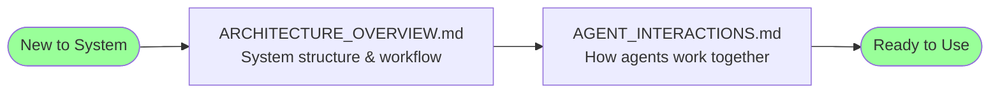
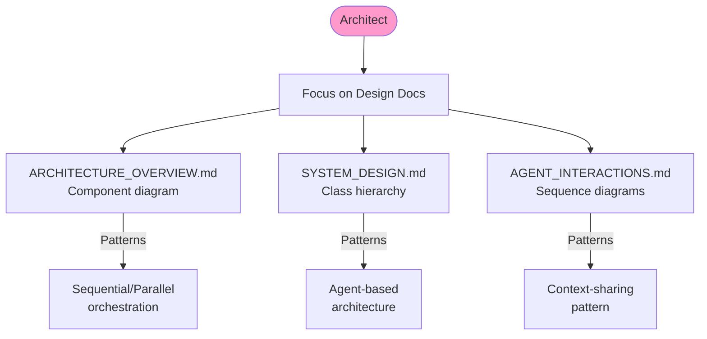
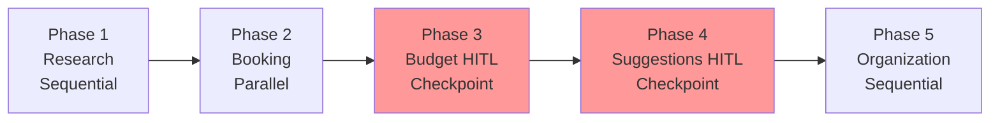
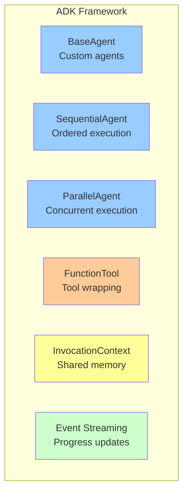
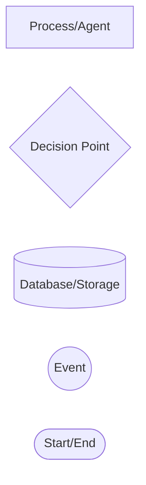

# ADK-Native Vacation Planner - Documentation Index

**Complete architectural documentation with Mermaid diagrams, system design, and implementation details**

---

## 📚 Documentation Overview

This documentation suite provides comprehensive coverage of the ADK-Native Vacation Planner system, including:

- **Architecture diagrams** (Mermaid)
- **Agent interaction flows**
- **System design patterns**
- **API integrations**
- **ADK concepts and patterns**
- **MCP (Model Context Protocol) concepts**

---

## 📖 Documentation Structure

```
docs/
├── README.md                          # ← You are here
├── ARCHITECTURE_OVERVIEW.md           # High-level system architecture
├── AGENT_INTERACTIONS.md              # Agent communication patterns
├── SYSTEM_DESIGN.md                   # Technical implementation details
├── API_INTEGRATIONS.md                # External API reference & MCP
└── ../WORKFLOW_OPTIMIZATION_SUMMARY.md # Optimization strategies
```

---

## 🗺️ Reading Guide

### **For New Users: Start Here**



**Recommended Path:**
1. [ARCHITECTURE_OVERVIEW.md](./ARCHITECTURE_OVERVIEW.md) - Understand the big picture
2. [AGENT_INTERACTIONS.md](./AGENT_INTERACTIONS.md) - See how agents communicate
3. Try the system with sample queries

---

### **For Developers: Deep Dive**

```mermaid
graph TD
    Dev([Developer]) --> All[Read All Docs]

    All --> A1[ARCHITECTURE_OVERVIEW.md]
    All --> A2[AGENT_INTERACTIONS.md]
    All --> A3[SYSTEM_DESIGN.md]
    All --> A4[API_INTEGRATIONS.md]
    All --> A5[WORKFLOW_OPTIMIZATION_SUMMARY.md]

    A3 -->|Focus| Code[Review Code<br/>adk_agents/ & tools/]
    A4 -->|Focus| APIs[Setup API Keys<br/>.env file]

    style Dev fill:#99ccff
    style Code fill:#ffcc99
    style APIs fill:#ffcc99
```



**Recommended Path:**
1. [ARCHITECTURE_OVERVIEW.md](./ARCHITECTURE_OVERVIEW.md) - System architecture
2. [SYSTEM_DESIGN.md](./SYSTEM_DESIGN.md) - Class structures & patterns
3. [API_INTEGRATIONS.md](./API_INTEGRATIONS.md) - External services
4. [AGENT_INTERACTIONS.md](./AGENT_INTERACTIONS.md) - Data flow
5. [WORKFLOW_OPTIMIZATION_SUMMARY.md](../WORKFLOW_OPTIMIZATION_SUMMARY.md) - Performance optimizations

---

### **For Architects: System Design**



**Recommended Path:**
1. [ARCHITECTURE_OVERVIEW.md](./ARCHITECTURE_OVERVIEW.md) - High-level design
2. [SYSTEM_DESIGN.md](./SYSTEM_DESIGN.md) - Implementation patterns
3. [AGENT_INTERACTIONS.md](./AGENT_INTERACTIONS.md) - Communication flow

---

## 📄 Document Summaries

### [ARCHITECTURE_OVERVIEW.md](./ARCHITECTURE_OVERVIEW.md)

**What's Inside:**
- ✅ Complete system architecture diagram
- ✅ 5-phase workflow orchestration
- ✅ Agent hierarchy (12 agents)
- ✅ External API integrations map
- ✅ Data flow diagrams
- ✅ ADK concepts overview
- ✅ Context-aware optimization patterns

**Key Diagrams:**
- High-level architecture
- Workflow orchestration (5 phases)
- Phase 1: Research agents (Sequential)
- Phase 2: Booking agents (Parallel)
- Phase 3 & 4: HITL checkpoints
- Phase 5: Organization agents
- External API integrations
- InvocationContext structure

**Who Should Read:**
- ✅ Everyone (start here)
- ✅ Project managers
- ✅ System architects
- ✅ New developers

---

### [AGENT_INTERACTIONS.md](./AGENT_INTERACTIONS.md)

**What's Inside:**
- ✅ Agent communication patterns
- ✅ Sequential execution flows
- ✅ Parallel execution diagrams
- ✅ Context sharing mechanisms
- ✅ Phase-by-phase interaction details
- ✅ HITL checkpoint flows
- ✅ Cross-agent data dependencies
- ✅ Error propagation patterns

**Key Diagrams:**
- Agent-to-agent communication via context
- Phase 1: Research sequence diagram
- Phase 2: Booking parallel execution
- Phase 3 & 4: HITL checkpoint state machines
- Phase 5: Organization sequence diagram
- Complete dependency graph
- Context reuse optimization
- Error handling flows

**Who Should Read:**
- ✅ Developers implementing new agents
- ✅ Debugging workflow issues
- ✅ Understanding data flow

---

### [SYSTEM_DESIGN.md](./SYSTEM_DESIGN.md)

**What's Inside:**
- ✅ Directory structure
- ✅ Class hierarchy diagrams
- ✅ Agent implementation patterns
- ✅ Tool implementation guide
- ✅ ADK concepts deep dive
- ✅ InvocationContext details
- ✅ Event streaming
- ✅ State management
- ✅ Error handling strategies
- ✅ MCP concepts (future use)

**Key Diagrams:**
- Component diagram
- Class hierarchy (Agent types)
- Tool integration pattern
- InvocationContext structure
- Sequential vs Parallel execution
- Event streaming flow
- HITL pattern state machine
- Workflow state transitions
- Error handling decision tree

**Who Should Read:**
- ✅ Developers (must read)
- ✅ Technical architects
- ✅ Code reviewers
- ✅ Anyone extending the system

---

### [API_INTEGRATIONS.md](./API_INTEGRATIONS.md)

**What's Inside:**
- ✅ All external API details
- ✅ Authentication & configuration
- ✅ State Department API (travel advisories)
- ✅ OpenWeather API (weather data)
- ✅ RestCountries API (country/currency)
- ✅ ExchangeRate API (currency rates)
- ✅ Tavily API (global events)
- ✅ Google Gemini API (LLM)
- ✅ Rate limits & quotas
- ✅ Error handling & fallbacks
- ✅ MCP (Model Context Protocol) explanation

**Key Diagrams:**
- API overview map
- Authentication flow
- State Dept API structure
- OpenWeather endpoints
- Advisory levels (1-4)
- Fallback strategies
- Rate limiting tracker
- MCP architecture (conceptual)
- Potential MCP integration

**Who Should Read:**
- ✅ Developers setting up APIs
- ✅ DevOps engineers
- ✅ Anyone troubleshooting API issues
- ✅ Cost/quota planners

---

### [WORKFLOW_OPTIMIZATION_SUMMARY.md](../WORKFLOW_OPTIMIZATION_SUMMARY.md)

**What's Inside:**
- ✅ Identified performance problems
- ✅ Optimization solutions implemented
- ✅ Before/after comparisons
- ✅ Context-aware agents
- ✅ Domestic travel optimization
- ✅ Suggestions checkpoint (new HITL)
- ✅ Performance metrics
- ✅ Testing recommendations

**Key Metrics:**
- Weather API calls: 66% reduction
- Immigration tools (domestic): 100% reduction
- Booking phase: 3x speedup
- Overall redundancy: ~60% reduction

**Who Should Read:**
- ✅ Performance engineers
- ✅ Understanding optimization rationale
- ✅ Reviewing before/after changes

---

## 🎯 Quick Reference

### Workflow Phases



### Agent List (12 Total)

| Phase | Agent | Tools | Type |
|-------|-------|-------|------|
| **1. Research** | Travel Advisory | 2 | Custom |
| | Destination Intelligence | 3 | Custom (Context-aware) |
| | Immigration Specialist | 3 | Custom (Domestic optimized) |
| | Currency Exchange | 4 | Custom |
| **2. Booking** | Flight Booking | 1 | Custom |
| | Hotel Booking | 1 | Custom |
| | Car Rental | 1 | Custom |
| **3. Budget HITL** | Budget Checkpoint | 1 | HITL Checkpoint |
| **4. Suggestions HITL** | Suggestions Checkpoint | 0 | HITL Checkpoint |
| **5. Organization** | Activities | 1 | Custom |
| | Itinerary | 3 | Custom |
| | Document Generator | 0 | Custom |

### External APIs (6 Total)

| API | Auth | Free? | Purpose |
|-----|------|-------|---------|
| State Department | None | ✅ | Travel advisories |
| RestCountries | None | ✅ | Country/currency info |
| OpenWeather | API Key | ✅ (1k/day) | Weather data |
| ExchangeRate | API Key | ✅ (1.5k/mo) | Currency rates |
| Tavily | API Key | ✅ (1k/mo) | Global events |
| Google Gemini | API Key | 💰 Pay-per-use | LLM reasoning |

### ADK Concepts Used



---

## 🔧 Setup & Configuration

### Environment Setup

```bash
# 1. Create .env file
cp .env.example .env

# 2. Add API keys
OPENWEATHER_API_KEY=your_key_here
EXCHANGERATE_API_KEY=your_key_here
TAVILY_API_KEY=your_key_here
GOOGLE_API_KEY=your_key_here

# 3. Install dependencies
pip install -r requirements.txt

# 4. Start server
cd adk-native
adk web agents_web --port 8080
```

**See:** [API_INTEGRATIONS.md](./API_INTEGRATIONS.md#authentication--configuration) for detailed setup

---

## 🎓 Learning Path

### Beginner Path (1-2 hours)

```
1. Read: ARCHITECTURE_OVERVIEW.md (30 min)
   └─ Focus: High-level architecture, workflow phases

2. Read: AGENT_INTERACTIONS.md (30 min)
   └─ Focus: Phase 1 & 2 diagrams, context sharing

3. Run: Sample query (15 min)
   └─ Test: Domestic travel query

4. Review: Logs and output (15 min)
   └─ Observe: Agent execution order
```

### Intermediate Path (3-4 hours)

```
1. Read: All overview docs (1 hour)
2. Read: SYSTEM_DESIGN.md (1 hour)
   └─ Focus: Class hierarchy, tool patterns
3. Read: API_INTEGRATIONS.md (1 hour)
   └─ Focus: API authentication, fallbacks
4. Code: Review 2-3 agent implementations (1 hour)
   └─ Files: travel_advisory.py, destination.py
```

### Advanced Path (Full day)

```
1. Read: All documentation (3 hours)
2. Code: Review all agents (2 hours)
3. Code: Review all tools (2 hours)
4. Experiment: Modify an agent (2 hours)
   └─ Example: Add new tool to destination agent
5. Test: Run comprehensive test suite (1 hour)
```

---

## 📊 Diagram Legend

### Shapes



### Colors

- 🟦 **Blue:** Core system components, agents
- 🟩 **Green:** Free APIs, successful states, optimizations
- 🟨 **Yellow:** Shared context, cache
- 🟧 **Orange:** Paid APIs, warnings
- 🟥 **Red:** HITL checkpoints, errors, blocked states
- 🟪 **Purple:** LLM/AI services

---

## 🔗 External Resources

### ADK Documentation
- [Google ADK Official Docs](https://google.github.io/adk-docs/)
- [ADK GitHub Repository](https://github.com/google/adk)
- [ADK Python SDK](https://pypi.org/project/google-adk/)

### API Documentation
- [State Department Travel Advisories](https://travel.state.gov/content/travel/en/traveladvisories/traveladvisories.html/)
- [OpenWeather API Docs](https://openweathermap.org/api)
- [RestCountries API](https://restcountries.com/)
- [ExchangeRate API Docs](https://www.exchangerate-api.com/docs)
- [Tavily API Docs](https://docs.tavily.com/)
- [Google Gemini API](https://ai.google.dev/docs)

### MCP Resources
- [Model Context Protocol Spec](https://modelcontextprotocol.io/)
- [MCP GitHub](https://github.com/modelcontextprotocol)

---

## 🤝 Contributing

### Adding New Documentation

When adding new documentation:

1. **Use Mermaid for diagrams** - Consistent visualization
2. **Follow existing structure** - Match current document format
3. **Update this README** - Add new doc to index
4. **Cross-reference** - Link to related docs
5. **Include examples** - Code snippets where helpful

### Documentation Standards

- **Mermaid diagrams:** Use consistent colors and shapes
- **Code examples:** Include complete, runnable code
- **File paths:** Use relative links when possible
- **Version info:** Update "Last Updated" date

---

## 📝 Version History

| Version | Date | Changes |
|---------|------|---------|
| 1.0 | 2025-11-22 | Initial comprehensive documentation |
|  |  | - Architecture overview |
|  |  | - Agent interactions |
|  |  | - System design |
|  |  | - API integrations |
|  |  | - Workflow optimizations |

---

## 📞 Support

### Documentation Issues

If you find issues in the documentation:

1. Check the "Last Updated" date - may be outdated
2. Review corresponding code in `adk_agents/` and `tools/`
3. Cross-reference with other documents
4. Verify against actual system behavior

### Technical Questions

For technical questions about:

- **ADK framework:** See [Google ADK Docs](https://google.github.io/adk-docs/)
- **APIs:** See [API_INTEGRATIONS.md](./API_INTEGRATIONS.md)
- **Agents:** See [SYSTEM_DESIGN.md](./SYSTEM_DESIGN.md)
- **Workflow:** See [ARCHITECTURE_OVERVIEW.md](./ARCHITECTURE_OVERVIEW.md)

---

## �� Quick Start

**New to the system? Start here:**

1. ✅ Read [ARCHITECTURE_OVERVIEW.md](./ARCHITECTURE_OVERVIEW.md) (30 minutes)
2. ✅ Set up API keys (see [API_INTEGRATIONS.md](./API_INTEGRATIONS.md#authentication--configuration))
3. ✅ Start the server: `adk web agents_web --port 8080`
4. ✅ Try a sample query: "Plan a 2-week vacation to Salt Lake City"
5. ✅ Review the logs and observe the workflow

**Want to develop? Continue with:**

6. ✅ Read [SYSTEM_DESIGN.md](./SYSTEM_DESIGN.md)
7. ✅ Review agent code in `adk_agents/`
8. ✅ Review tool code in `tools/`
9. ✅ Try modifying an agent or tool

---

**Happy Learning! 📚**

**Document Version:** 1.0
**Last Updated:** 2025-11-22
**Maintained By:** ADK-Native Vacation Planner Team
