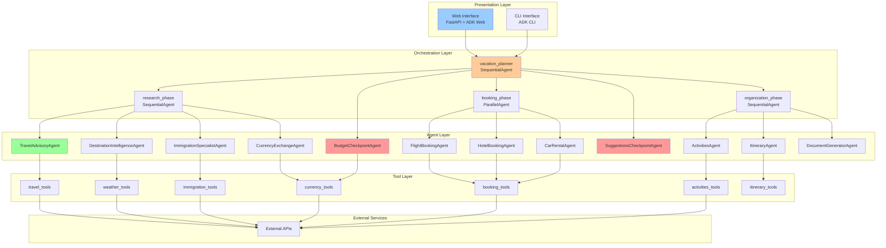
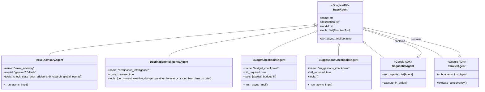
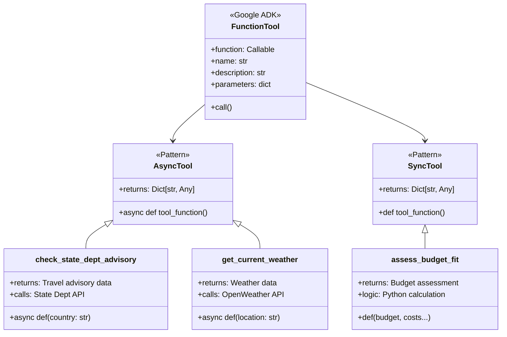
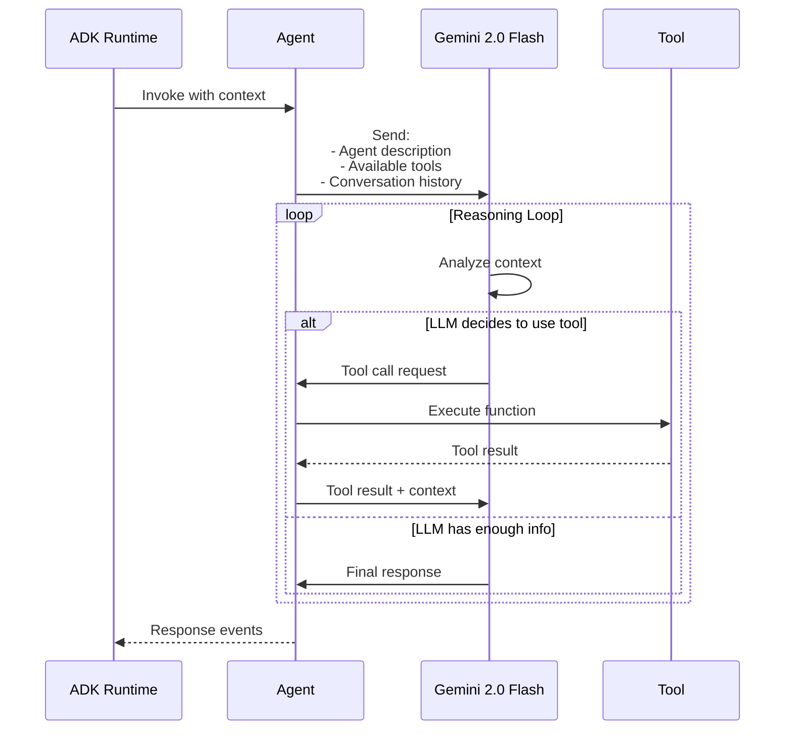
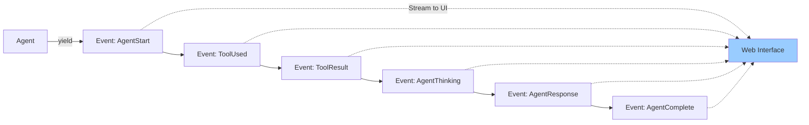
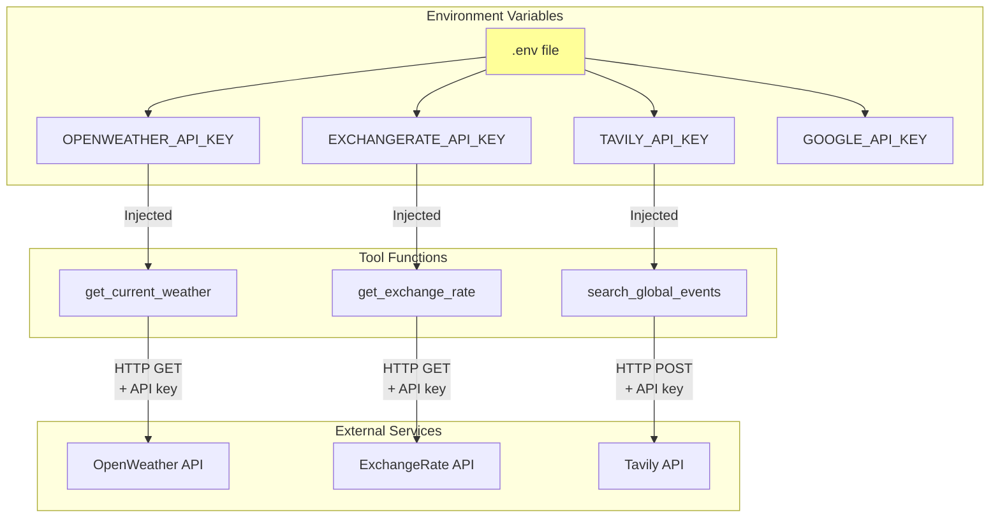
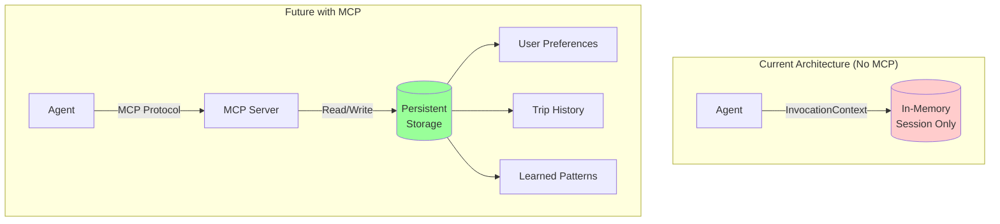
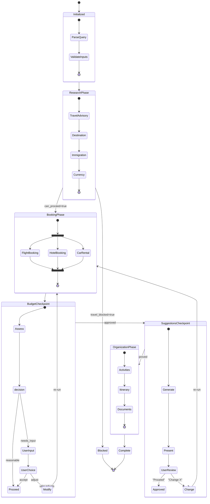

# System Design - ADK-Native Vacation Planner

**Purpose:** Technical implementation details, class structures, and design patterns

---

## Table of Contents

1. [System Architecture](#system-architecture)
2. [Class Hierarchy](#class-hierarchy)
3. [Tool Implementation](#tool-implementation)
4. [ADK Concepts Deep Dive](#adk-concepts-deep-dive)
5. [External API Integration](#external-api-integration)
6. [MCP (Model Context Protocol)](#mcp-model-context-protocol)
7. [State Management](#state-management)
8. [Error Handling](#error-handling)

---

## System Architecture

### Directory Structure

```
adk-native/
├── adk_agents/              # Agent implementations
│   ├── __init__.py
│   ├── travel_advisory.py   # Travel Advisory Agent
│   ├── destination.py       # Destination Intelligence
│   ├── immigration.py       # Immigration Specialist
│   ├── currency.py          # Currency Exchange
│   ├── booking.py           # Flight/Hotel/Car agents
│   ├── activities.py        # Activities Agent
│   ├── itinerary.py         # Itinerary Agent
│   ├── documents.py         # Document Generator
│   ├── budget_checkpoint.py # Budget HITL
│   └── suggestions_checkpoint.py  # Suggestions HITL
├── tools/                   # Tool implementations
│   ├── travel_tools.py      # State Dept, Tavily
│   ├── weather_tools.py     # Weather APIs
│   ├── immigration_tools.py # Visa tools
│   ├── currency_tools.py    # Currency, budget tools
│   ├── booking_tools.py     # Flight/Hotel/Car tools
│   ├── activities_tools.py  # Activities tools
│   └── itinerary_tools.py   # Itinerary tools
├── workflows/               # Workflow orchestration
│   └── vacation_workflow.py # Main workflow
├── agents_web/              # Web interface
│   └── vacation_planner/
│       └── agent.py         # ADK web entry point
├── docs/                    # Documentation
└── .env                     # Environment variables
```

### Component Diagram



---

## Class Hierarchy

### Agent Base Classes



### Agent Implementation Example

```python
# adk_agents/destination.py

from google.adk.agents import Agent
from google.adk.tools import FunctionTool
from tools.weather_tools import (
    get_current_weather,
    get_weather_forecast,
    get_best_time_to_visit
)

class DestinationIntelligenceAgent(Agent):
    """
    Context-aware destination intelligence agent.
    Checks conversation history before calling weather APIs.
    """

    def __init__(self):
        super().__init__(
            name="destination_intelligence",
            description="""You are a destination weather specialist.

🔍 CONTEXT-AWARE OPTIMIZATION:
1. CHECK CONVERSATION HISTORY FIRST
2. REUSE IF AVAILABLE (< 15 minutes old)
3. ONLY CALL TOOLS WHEN NEEDED

WHEN TO CALL WEATHER TOOLS:
✅ Call get_current_weather IF:
   - No weather data in conversation history, OR
   - Weather data is stale (>15 min old), OR
   - Destination has changed

❌ DO NOT call weather tools IF:
   - Weather data already exists in recent conversation
   - Just reuse and acknowledge the existing data

[... rest of description ...]
""",
            model="gemini-2.0-flash",
            tools=[
                FunctionTool(get_current_weather),
                FunctionTool(get_weather_forecast),
                FunctionTool(get_best_time_to_visit)
            ]
        )

    # No need to override _run_async_impl
    # ADK handles tool calling based on description
```

---

## Tool Implementation

### Tool Function Structure



### Tool Implementation Pattern

```python
# tools/weather_tools.py

import httpx
from typing import Dict, Any
from loguru import logger

async def get_current_weather(location: str) -> Dict[str, Any]:
    """
    Get current weather for a location.

    Args:
        location: City name or coordinates

    Returns:
        Dict with temperature, conditions, humidity, etc.

    Tool behavior:
    - Calls OpenWeather API
    - Returns structured weather data
    - LLM interprets and formats for user
    """
    api_key = os.getenv("OPENWEATHER_API_KEY")

    if not api_key:
        logger.warning("[WEATHER] No API key, using estimates")
        return {
            "location": location,
            "temperature": "Unknown",
            "note": "Set OPENWEATHER_API_KEY for real data"
        }

    try:
        url = f"https://api.openweathermap.org/data/2.5/weather"
        params = {
            "q": location,
            "appid": api_key,
            "units": "metric"
        }

        async with httpx.AsyncClient(timeout=10) as client:
            response = await client.get(url, params=params)

            if response.status_code == 200:
                data = response.json()
                return {
                    "location": location,
                    "temperature": data["main"]["temp"],
                    "feels_like": data["main"]["feels_like"],
                    "humidity": data["main"]["humidity"],
                    "conditions": data["weather"][0]["description"],
                    "wind_speed": data["wind"]["speed"],
                    "timestamp": datetime.now().isoformat()
                }
    except Exception as e:
        logger.error(f"[WEATHER] API error: {e}")
        return {
            "location": location,
            "error": str(e),
            "note": "Failed to fetch weather data"
        }
```

### Tool Registration

```python
# In agent __init__

from google.adk.tools import FunctionTool
from tools.weather_tools import get_current_weather

tools=[
    FunctionTool(get_current_weather),  # ADK wraps the function
    # Function signature → OpenAPI schema
    # LLM can call this tool when needed
]
```

---

## ADK Concepts Deep Dive

### 1. InvocationContext

```mermaid
graph TB
    subgraph "InvocationContext Structure"
        IC[InvocationContext]

        IC --> Messages[messages: List[Message]]
        IC --> Tools[available_tools: List[Tool]]
        IC --> Session[session_id: str]
        IC --> User[user_id: str]
        IC --> Metadata[metadata: dict]

        Messages --> Msg1[Message 1: User query]
        Messages --> Msg2[Message 2: Agent 1 response]
        Messages --> Msg3[Message 3: Agent 2 response]
        Messages --> MsgN[Message N: Current agent]

        Metadata --> Custom[Custom data from agents]
    end

    subgraph "Context Usage"
        Agent[Agent Execution]
        Agent -->|Read| IC
        Agent -->|Write new message| Messages
        Agent -->|Add metadata| Metadata
    end

    style IC fill:#ffff99
```

**Key Features:**
- **Shared memory** across all agents in a workflow
- **Conversation history** accessible to all agents
- **Metadata storage** for custom data
- **Session persistence** for multi-turn conversations

**Example Usage:**

```python
# Agent reads context
async def _run_async_impl(self, context: InvocationContext):
    # Read previous agent outputs
    for message in context.messages:
        if message.role == "agent":
            # Check if weather data already exists
            if "weather" in message.content:
                # Reuse existing data
                return

    # No weather data found, call API
    weather_data = await get_current_weather(location)

    # ADK automatically adds response to context
    return f"Weather: {weather_data}"
```

### 2. Agent Execution Flow



### 3. Sequential vs Parallel Execution

```python
# Sequential Agent (Phase 1: Research)
research_phase = SequentialAgent(
    name="research_phase",
    sub_agents=[
        TravelAdvisoryAgent(),      # Runs first
        DestinationIntelligenceAgent(),  # Then this
        ImmigrationSpecialistAgent(),    # Then this
        CurrencyExchangeAgent()     # Then this
    ]
)
# Total time: sum of all agent times

# Parallel Agent (Phase 2: Booking)
booking_phase = ParallelAgent(
    name="booking_phase",
    sub_agents=[
        FlightBookingAgent(),    # \
        HotelBookingAgent(),     # |- All run simultaneously
        CarRentalAgent()         # /
    ]
)
# Total time: max of all agent times (3x faster)
```

### 4. Event Streaming



**Event Types:**
- `AgentStart`: Agent begins execution
- `ToolUsed`: Agent calls a tool
- `ToolResult`: Tool returns data
- `AgentThinking`: LLM is processing
- `AgentResponse`: Agent outputs text
- `AgentComplete`: Agent finished

---

## External API Integration

### API Authentication



### API Client Pattern

```python
# tools/weather_tools.py

import os
import httpx
from typing import Dict, Any, Optional
from loguru import logger

class WeatherAPIClient:
    """Reusable HTTP client for Weather API"""

    BASE_URL = "https://api.openweathermap.org/data/2.5"

    def __init__(self):
        self.api_key = os.getenv("OPENWEATHER_API_KEY")
        if not self.api_key:
            logger.warning("[WEATHER] No API key found")

    async def get_current(self, location: str) -> Optional[Dict[str, Any]]:
        """Get current weather"""
        if not self.api_key:
            return self._fallback_response(location)

        try:
            async with httpx.AsyncClient(timeout=10) as client:
                response = await client.get(
                    f"{self.BASE_URL}/weather",
                    params={
                        "q": location,
                        "appid": self.api_key,
                        "units": "metric"
                    }
                )

                if response.status_code == 200:
                    return self._parse_response(response.json())
                else:
                    logger.error(f"[WEATHER] API returned {response.status_code}")
                    return self._fallback_response(location)

        except httpx.TimeoutException:
            logger.error("[WEATHER] Request timeout")
            return self._fallback_response(location)

        except Exception as e:
            logger.error(f"[WEATHER] Error: {e}")
            return self._fallback_response(location)

    def _parse_response(self, data: dict) -> Dict[str, Any]:
        """Parse API response into standard format"""
        return {
            "temperature": data["main"]["temp"],
            "feels_like": data["main"]["feels_like"],
            "humidity": data["main"]["humidity"],
            "conditions": data["weather"][0]["description"],
            "wind_speed": data["wind"]["speed"]
        }

    def _fallback_response(self, location: str) -> Dict[str, Any]:
        """Fallback when API unavailable"""
        return {
            "location": location,
            "note": "Weather API unavailable - using estimates",
            "source": "fallback"
        }

# Tool function uses client
async def get_current_weather(location: str) -> Dict[str, Any]:
    """ADK tool function"""
    client = WeatherAPIClient()
    return await client.get_current(location)
```

### Rate Limiting & Caching

```python
# Simple in-memory cache
from datetime import datetime, timedelta
from typing import Dict, Any, Optional

_weather_cache: Dict[str, tuple[Dict[str, Any], datetime]] = {}

async def get_current_weather(location: str) -> Dict[str, Any]:
    """Weather tool with caching"""

    # Check cache
    cache_key = location.lower()
    if cache_key in _weather_cache:
        data, timestamp = _weather_cache[cache_key]
        age = datetime.now() - timestamp

        if age < timedelta(minutes=15):
            logger.info(f"[WEATHER] Using cached data for {location}")
            data["cache_hit"] = True
            return data

    # Cache miss or stale - fetch from API
    logger.info(f"[WEATHER] Fetching fresh data for {location}")
    client = WeatherAPIClient()
    data = await client.get_current(location)

    # Store in cache
    _weather_cache[cache_key] = (data, datetime.now())
    data["cache_hit"] = False

    return data
```

---

## MCP (Model Context Protocol)

### MCP Integration (Future Enhancement)

Model Context Protocol could be used for:

1. **Persistent Context Storage**
2. **Cross-Session Memory**
3. **User Preference Storage**



**Potential MCP Use Cases:**

```python
# Future MCP integration example
class TravelAdvisoryAgentWithMCP(Agent):
    def __init__(self):
        super().__init__(
            name="travel_advisory",
            # ... other config ...
        )
        # Connect to MCP server
        self.mcp_client = MCPClient("vacation_planner")

    async def _run_async_impl(self, context):
        # Read user's previous trips from MCP
        user_history = await self.mcp_client.get(
            f"user:{context.user_id}:trip_history"
        )

        # Personalize recommendations based on history
        if user_history:
            # User has been to beach destinations before
            # Maybe suggest mountain trip this time
            pass

        # ... normal agent logic ...

        # Store this trip in MCP
        await self.mcp_client.set(
            f"user:{context.user_id}:trip_history",
            current_trip_data
        )
```

**Note:** MCP is not currently used in this implementation but could enhance future versions.

---

## State Management

### Workflow State Transitions



### Context State Evolution

```python
# Pseudo-code showing how context evolves

# Initial state
context = {
    "messages": [
        {"role": "user", "content": "Plan vacation to SLC"}
    ],
    "metadata": {}
}

# After Travel Advisory
context["metadata"]["travel_type"] = "domestic"
context["metadata"]["can_proceed"] = True
context["messages"].append({
    "role": "agent",
    "agent": "travel_advisory",
    "content": "Travel cleared - domestic trip"
})

# After Destination Intelligence
context["metadata"]["weather"] = {
    "temp": 4,
    "conditions": "clear",
    "timestamp": "2025-11-22T01:30:00"
}

# After Budget Checkpoint
context["metadata"]["budget_status"] = "reasonable"
context["metadata"]["estimated_cost"] = 2130

# After Suggestions Checkpoint
context["metadata"]["user_approved"] = True
context["metadata"]["approval_timestamp"] = "2025-11-22T01:45:00"

# Final state contains complete trip plan
```

---

## Error Handling

### Error Handling Strategy

```mermaid
graph TD
    Error[Error Occurs] --> CheckType{Error Type?}

    CheckType -->|API Timeout| Retry[Retry with<br/>Exponential Backoff]
    CheckType -->|API 4xx| Fallback[Use Fallback<br/>Data]
    CheckType -->|Travel Blocked| Stop[STOP Workflow<br/>Inform User]
    CheckType -->|Tool Error| LogContinue[Log Error<br/>Continue with<br/>Degraded Data]

    Retry -->|Success| Continue[Continue Workflow]
    Retry -->|Fail After 3x| Fallback

    Fallback --> Continue

    Stop --> UserNotified[User Notified]
    UserNotified --> [*]

    LogContinue --> Continue

    Continue --> [*]

    style Stop fill:#ff9999
    style Fallback fill:#ffcc99
```

### Implementation

```python
# tools/weather_tools.py

import asyncio
from typing import Dict, Any
from loguru import logger

async def get_current_weather(location: str) -> Dict[str, Any]:
    """Weather tool with comprehensive error handling"""

    max_retries = 3
    retry_delay = 1  # seconds

    for attempt in range(max_retries):
        try:
            async with httpx.AsyncClient(timeout=10) as client:
                response = await client.get(
                    "https://api.openweathermap.org/data/2.5/weather",
                    params={"q": location, "appid": api_key}
                )

                if response.status_code == 200:
                    return _parse_weather(response.json())

                elif response.status_code == 404:
                    # Location not found - don't retry
                    logger.error(f"[WEATHER] Location not found: {location}")
                    return _fallback_weather(location)

                elif response.status_code >= 500:
                    # Server error - retry
                    if attempt < max_retries - 1:
                        logger.warning(f"[WEATHER] Server error, retry {attempt+1}")
                        await asyncio.sleep(retry_delay * (2 ** attempt))
                        continue

        except httpx.TimeoutException:
            if attempt < max_retries - 1:
                logger.warning(f"[WEATHER] Timeout, retry {attempt+1}")
                await asyncio.sleep(retry_delay * (2 ** attempt))
                continue

        except Exception as e:
            logger.error(f"[WEATHER] Unexpected error: {e}")
            break

    # All retries failed - use fallback
    logger.warning(f"[WEATHER] Using fallback for {location}")
    return _fallback_weather(location)

def _fallback_weather(location: str) -> Dict[str, Any]:
    """Fallback weather estimates based on LLM knowledge"""
    return {
        "location": location,
        "source": "fallback",
        "note": "Weather API unavailable",
        "llm_instruction": f"Provide typical weather for {location} in current season"
    }
```

---

## Performance Optimizations

### 1. Context Caching

```python
# Agent checks context before calling tools

description="""
🔍 CONTEXT-AWARE OPTIMIZATION:
1. CHECK CONVERSATION HISTORY FIRST
2. REUSE IF AVAILABLE (< 15 minutes old)
3. ONLY CALL TOOLS WHEN NEEDED
"""
```

### 2. Parallel Execution

```python
# Booking phase runs 3 agents concurrently
ParallelAgent(
    sub_agents=[
        FlightBookingAgent(),
        HotelBookingAgent(),
        CarRentalAgent()
    ]
)
# Result: 3x speedup
```

### 3. Domestic Travel Short-Circuit

```python
# Immigration agent skips tools for domestic travel

if travel_type == "domestic":
    # Don't call visa tools
    # Just return simple response
    return "No visa needed - domestic travel"
```

---

## Summary

### Key Design Patterns

1. **Agent-Based Architecture:** Specialized agents for each concern
2. **Sequential/Parallel Composition:** Mix of ordered and concurrent execution
3. **Context Sharing:** InvocationContext as shared memory
4. **HITL Checkpoints:** Human approval at critical points
5. **Graceful Degradation:** Fallbacks when APIs fail
6. **Context-Aware Optimization:** Reuse data to avoid redundant calls

### Technology Stack

- **Framework:** Google ADK
- **Language:** Python 3.10+
- **LLM:** Gemini 2.0 Flash
- **HTTP Client:** httpx (async)
- **Logging:** loguru
- **Web Server:** FastAPI (via ADK)
- **Validation:** Pydantic

---

**Next:** Review [API Integration Details](./API_INTEGRATIONS.md)

**Document Version:** 1.0
**Last Updated:** 2025-11-22
