# AI-Powered Vacation Planner - System Architecture

## Table of Contents
1. [System Overview](#system-overview)
2. [Multi-Agent Architecture](#multi-agent-architecture)
3. [Workflow Diagrams](#workflow-diagrams)
4. [Data Flow](#data-flow)
5. [Security Architecture](#security-architecture)
6. [Integration Architecture](#integration-architecture)

---

## System Overview

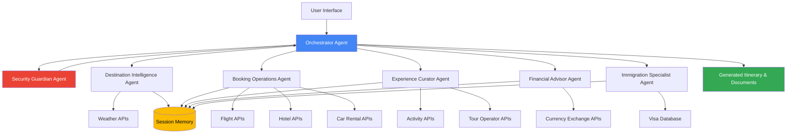

---

## Multi-Agent Architecture

### Agent Hierarchy and Responsibilities

```mermaid
graph TD
    A[Orchestrator Agent] --> B[Security Guardian Agent]
    A --> C[Destination Intelligence Agent]
    A --> D[Booking Operations Agent]
    A --> E[Experience Curator Agent]
    A --> F[Financial Advisor Agent]
    A --> G[Immigration Specialist Agent]

    B --> B1[PII Detection]
    B --> B2[Data Redaction]
    B --> B3[Audit Logging]

    C --> C1[Weather Analysis]
    C --> C2[Climate Scoring]
    C --> C3[Seasonal Insights]

    D --> D1[Flight Search]
    D --> D2[Hotel Finder]
    D --> D3[Car Rental]

    E --> E1[Activity Discovery]
    E --> E2[Tour Recommendations]
    E --> E3[Cultural Insights]

    F --> F1[Currency Conversion]
    F --> F2[Budget Estimation]
    F --> F3[Cost Optimization]

    G --> G1[Visa Requirements]
    G --> G2[Documentation Guide]
    G --> G3[Application Process]

    style A fill:#4285f4,color:#fff
    style B fill:#ea4335,color:#fff
    style C fill:#34a853,color:#fff
    style D fill:#fbbc04,color:#000
    style E fill:#9c27b0,color:#fff
    style F fill:#ff6f00,color:#fff
    style G fill:#00acc1,color:#fff
```

### Agent Communication Flow

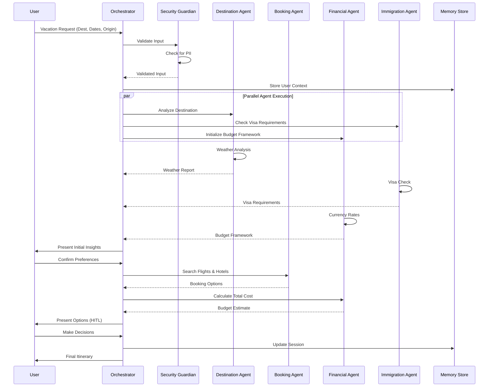

---

## Workflow Diagrams

### End-to-End Vacation Planning Workflow

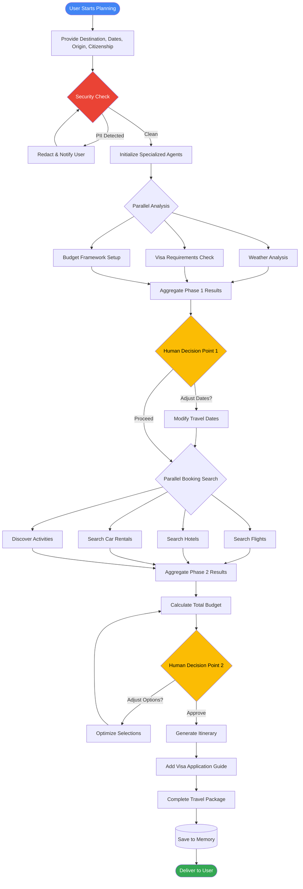

### Human-in-the-Loop Decision Points

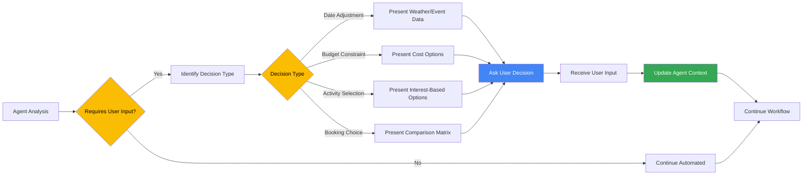

---

## Data Flow

### Information Flow Architecture

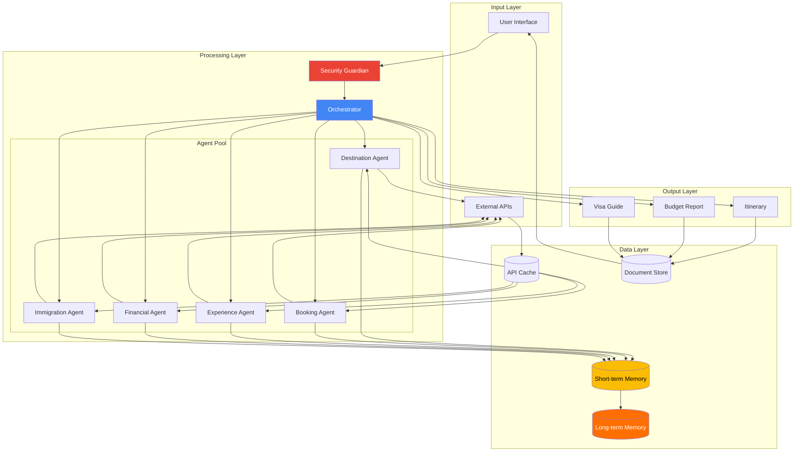

### Session Memory Management

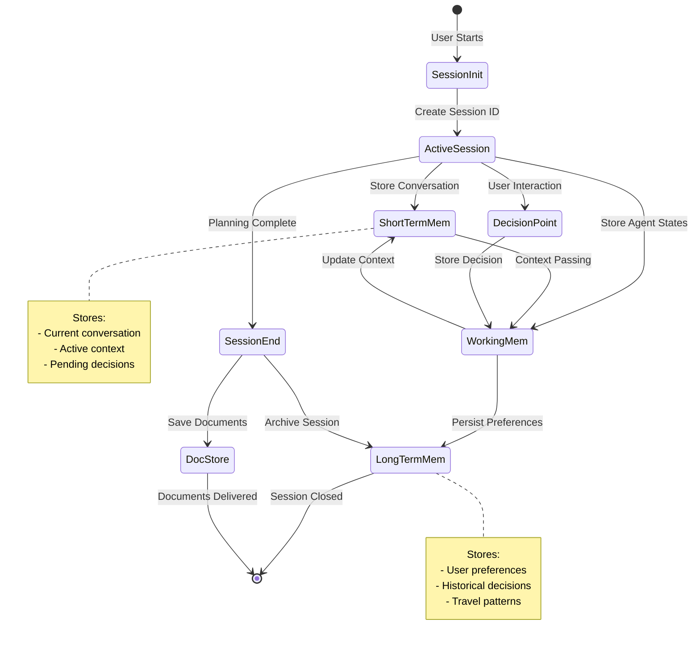

---

## Security Architecture

### PII Detection and Protection Pipeline

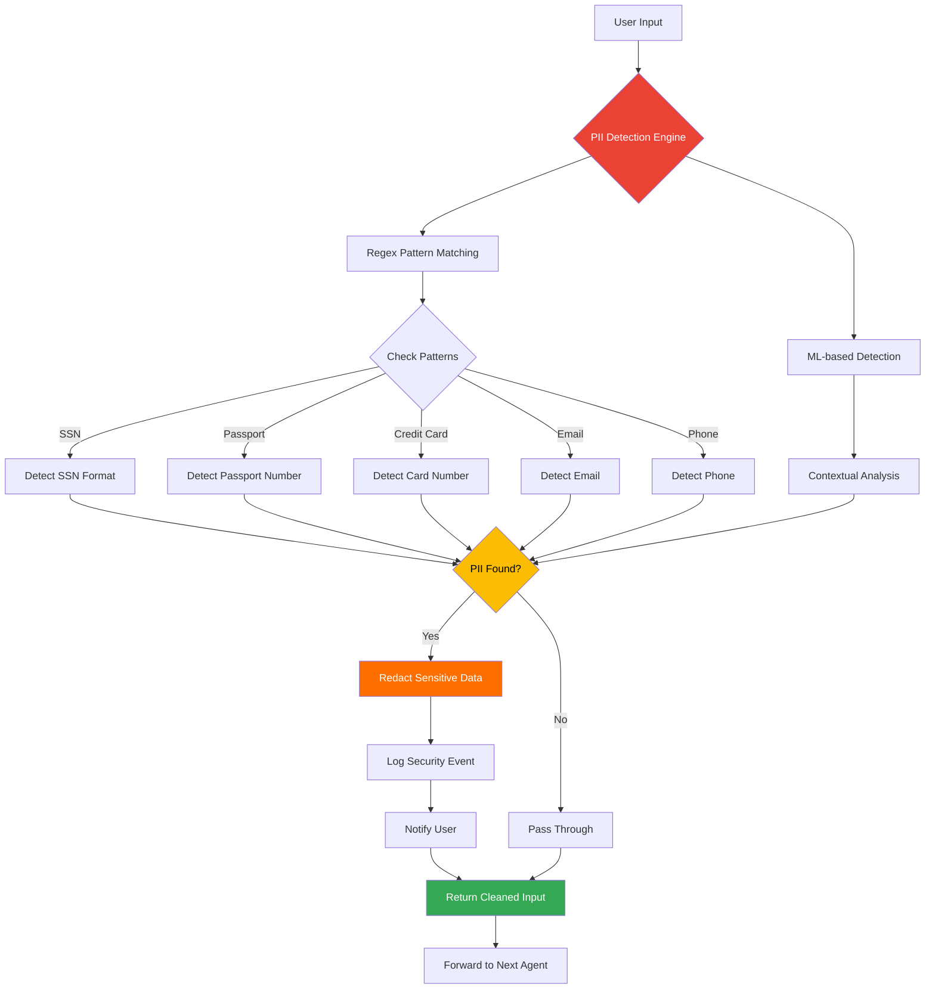

### Security Guardrail Implementation

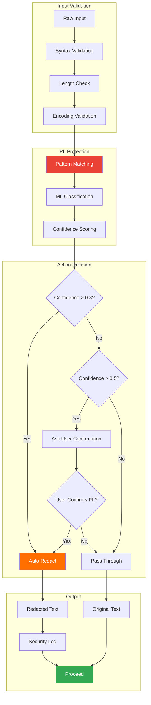

---

## Integration Architecture

### MCP and Tool Integration

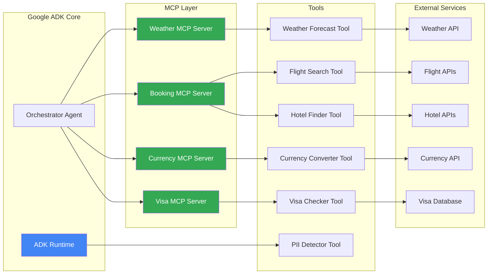

### Agent-to-Tool Communication Pattern

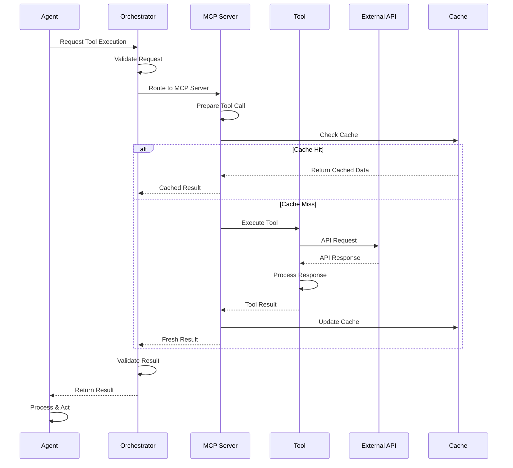

---

## Deployment Architecture

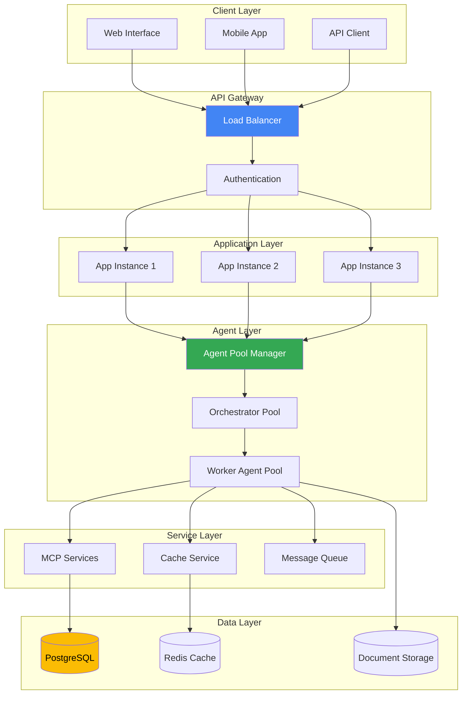

---

## Technology Stack

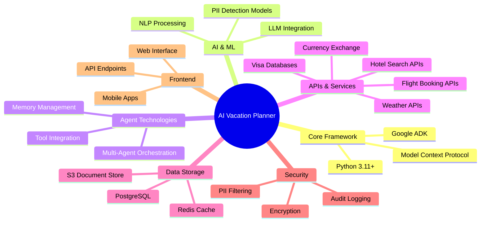

---

## Performance Optimization

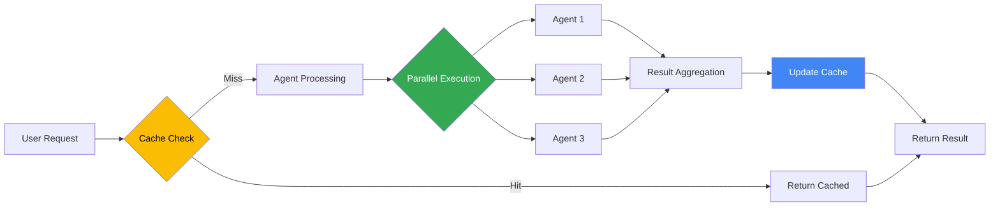

---

## Monitoring and Observability

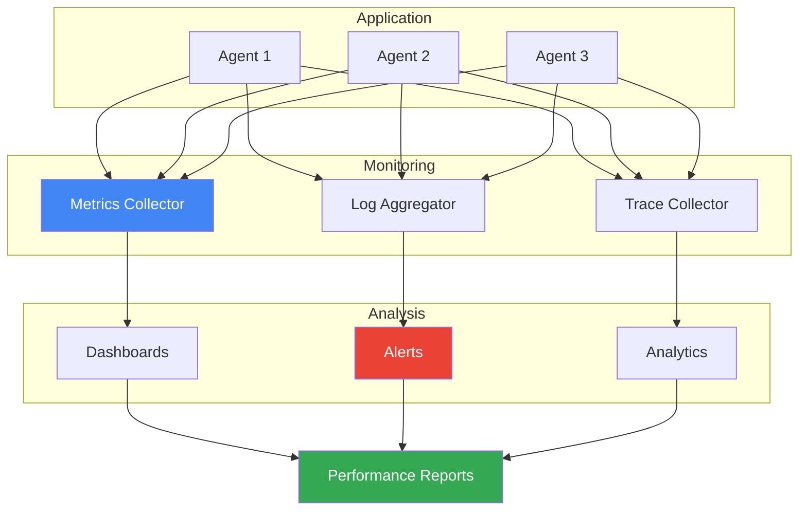

---

## Conclusion

This architecture provides a robust, scalable, and secure foundation for the AI-Powered Vacation Planner. The multi-agent design ensures specialization and efficiency, while the comprehensive security measures protect user data. The integration architecture enables seamless connectivity with external services, and the human-in-the-loop design ensures user control and personalization throughout the planning process.
