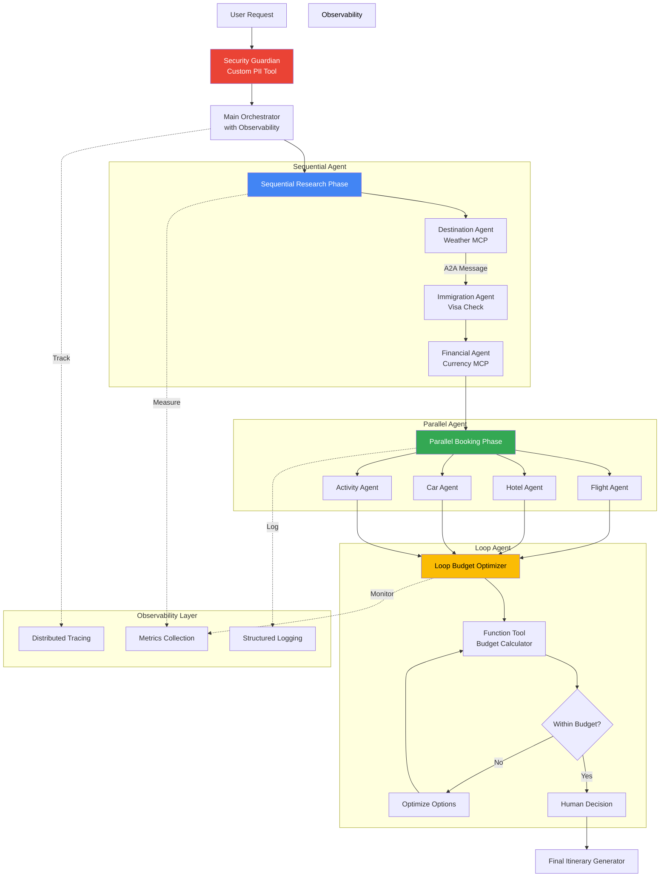
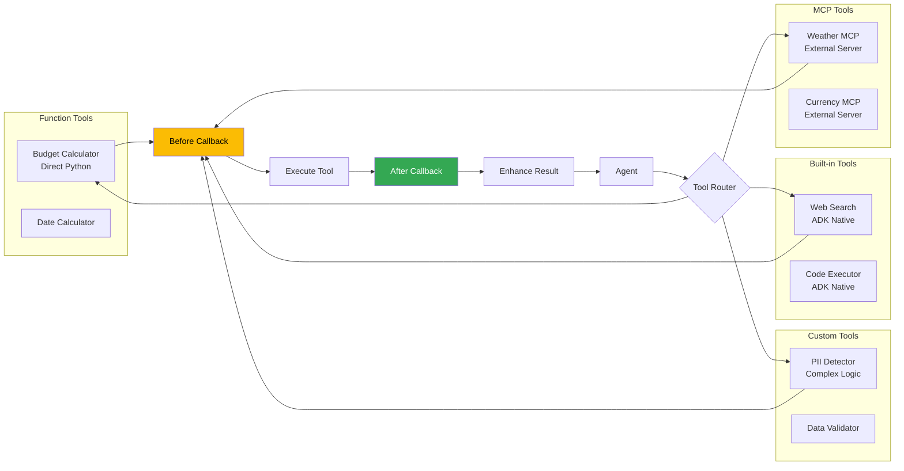
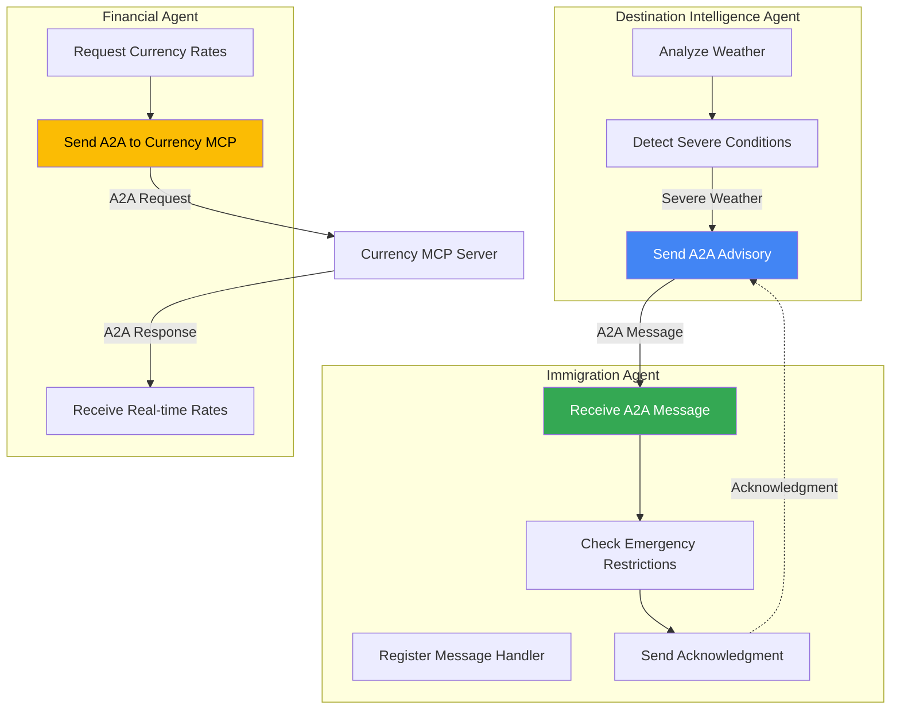
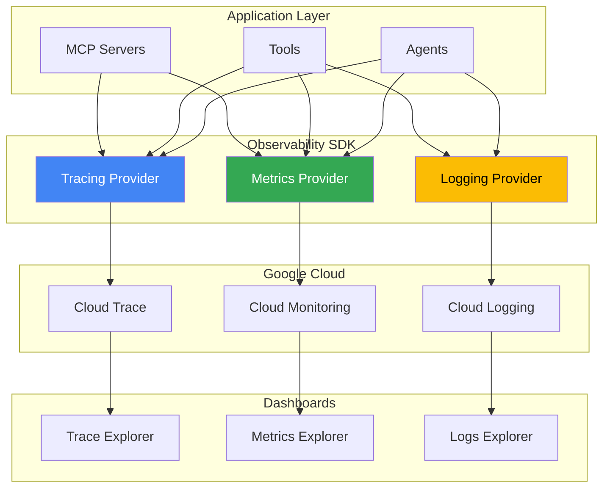
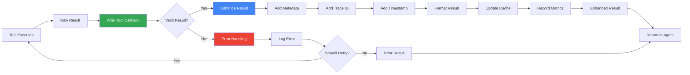

# Detailed Architecture with Advanced ADK Features

## System Architecture Overview



## Agent Execution Flow with Callbacks

```mermaid
sequenceDiagram
    participant U as User
    participant O as Orchestrator
    participant CB as Callbacks
    participant SEQ as Sequential Agent
    participant PARN as Parallel Agent
    participant LOOP as Loop Agent
    participant OBS as Observability

    U->>O: Vacation Request

    O->>CB: before_agent_execute
    CB->>OBS: Log Start Event
    CB-->>O: proceed

    O->>SEQ: Execute Research Phase

    SEQ->>CB: before_agent_execute(destination)
    CB-->>SEQ: proceed
    SEQ->>SEQ: Weather Analysis (MCP)
    SEQ->>CB: after_agent_execute
    CB->>OBS: Log Metrics

    SEQ->>SEQ: A2A Message to Immigration
    SEQ->>SEQ: Visa Check
    SEQ->>SEQ: Financial Setup
    SEQ-->>O: Research Results

    O->>PARN: Execute Booking Phase

    par Parallel Execution
        PARN->>CB: before_tool_execute(flight_search)
        CB-->>PARN: proceed
        PARN->>PARN: Flight Search
        PARN->>CB: after_tool_execute

        PARN->>CB: before_tool_execute(hotel_search)
        CB-->>PARN: proceed
        PARN->>PARN: Hotel Search
        PARN->>CB: after_tool_execute

        PARN->>CB: before_tool_execute(car_search)
        CB-->>PARN: proceed
        PARN->>PARN: Car Search
        PARN->>CB: after_tool_execute
    end

    PARN-->>O: Booking Results

    O->>LOOP: Optimize Budget

    loop Until Budget Met or Max Iterations
        LOOP->>CB: before_tool_execute(budget_calc)
        CB-->>LOOP: proceed
        LOOP->>LOOP: Calculate Total
        LOOP->>CB: after_tool_execute

        alt Over Budget
            LOOP->>LOOP: Find Cheaper Options
        else Within Budget
            LOOP->>LOOP: Exit Loop
        end
    end

    LOOP-->>O: Optimized Options

    O->>CB: after_agent_execute
    CB->>OBS: Log Final Metrics
    O-->>U: Complete Itinerary
```

## Tool Types and Callbacks Flow



## Agent-to-Agent Communication Patterns



## Observability Architecture



## Complete Data Flow with All Features

```mermaid
flowchart TB
    Start([User Inputs Vacation Request]) --> PII[Custom Tool: PII Detector]

    PII -->|Before Callback| PIILog[Log PII Check Start]
    PIILog --> PIIExec[Execute Detection]
    PIIExec -->|After Callback| PIIResult[Enhanced Result]

    PIIResult --> Orch[Orchestrator Start]

    Orch -->|Start Span| TraceRoot[Root Trace Span]
    TraceRoot -->|Metric: request_count| MetricInc[Increment Counter]

    MetricInc --> SeqStart[Sequential Agent: Research]

    SeqStart -->|Span: research_phase| TraceSeq[Research Trace]
    TraceSeq --> WeatherAgent[Destination Agent]

    WeatherAgent -->|MCP Call| WeatherMCP[Weather MCP Server]
    WeatherMCP -->|Before Callback| WeatherLog[Log Weather Request]
    WeatherLog --> WeatherData[Fetch Weather Data]
    WeatherData -->|After Callback| WeatherMetric[Record Duration]

    WeatherMetric -->|Severe Weather?| A2ACheck{Check Conditions}
    A2ACheck -->|Yes| A2AMsg[Send A2A to Immigration]
    A2ACheck -->|No| ImmAgent[Immigration Agent]
    A2AMsg --> ImmAgent

    ImmAgent -->|Handle A2A| ImmProcess[Process Advisory]
    ImmProcess --> VisaCheck[Check Visa Requirements]
    VisaCheck --> FinAgent[Financial Agent]

    FinAgent -->|MCP Call| CurrencyMCP[Currency MCP Server]
    CurrencyMCP --> CurrencyData[Get Exchange Rates]
    CurrencyData --> SeqComplete[Sequential Complete]

    SeqComplete -->|Metric: seq_duration| RecordSeq[Record Duration]
    RecordSeq --> ParStart[Parallel Agent: Booking]

    ParStart -->|Span: booking_phase| TracePar[Booking Trace]

    TracePar --> ParExec{Parallel Execution}
    ParExec -->|Thread 1| Flight[Flight Search]
    ParExec -->|Thread 2| Hotel[Hotel Search]
    ParExec -->|Thread 3| Car[Car Search]
    ParExec -->|Thread 4| Activity[Activity Search]

    Flight -->|Callback| FlightMetric[Log Flight Duration]
    Hotel -->|Callback| HotelMetric[Log Hotel Duration]
    Car -->|Callback| CarMetric[Log Car Duration]
    Activity -->|Callback| ActivityMetric[Log Activity Duration]

    FlightMetric --> ParComplete[Gather Results]
    HotelMetric --> ParComplete
    CarMetric --> ParComplete
    ActivityMetric --> ParComplete

    ParComplete -->|Metric: parallel_speedup| RecordPar[Record Speedup]
    RecordPar --> LoopStart[Loop Agent: Budget Optimizer]

    LoopStart -->|Span: budget_loop| TraceLoop[Loop Trace]
    TraceLoop --> LoopIter{Iteration Start}

    LoopIter -->|Function Tool| BudgetCalc[Budget Calculator]
    BudgetCalc -->|Before Callback| CalcLog[Log Calculation]
    CalcLog --> CalcExec[Execute Calculation]
    CalcExec -->|After Callback| CalcResult[Enhanced Result]

    CalcResult --> BudgetCheck{Within Budget?}
    BudgetCheck -->|No| Optimize[Find Cheaper Options]
    Optimize -->|Metric: iteration_count| IterMetric[Record Iteration]
    IterMetric --> LoopIter

    BudgetCheck -->|Yes| HITL[Human Decision Point]
    HITL -->|Log: user_decision| DecisionLog[Log Decision]

    DecisionLog --> FinalGen[Generate Final Itinerary]
    FinalGen -->|Close Span| TraceEnd[End Root Span]

    TraceEnd -->|Metric: total_duration| FinalMetric[Record Total Time]
    FinalMetric -->|Log: completion| CompletionLog[Log Success]

    CompletionLog --> End([Return Complete Plan])

    style PII fill:#ea4335,color:#fff
    style SeqStart fill:#4285f4,color:#fff
    style ParStart fill:#34a853,color:#fff
    style LoopStart fill:#fbbc04,color:#000
    style A2AMsg fill:#9c27b0,color:#fff
```



## Callback Execution Timeline

```
Time →

Before Agent Execute (Orchestrator)
    ├─ Log Start
    ├─ Start Tracing Span
    └─ Initialize Metrics

Before Agent Execute (Sequential)
    ├─ Validate Input
    └─ Log Sequential Start

    Before Tool Execute (Weather MCP)
        ├─ Validate Args
        ├─ Start Timer
        └─ Log Tool Start

    Execute: Weather MCP

    After Tool Execute (Weather MCP)
        ├─ Record Duration
        ├─ Enhance Result
        ├─ Log Completion
        └─ Update Metrics

    A2A Communication (Destination → Immigration)
        ├─ Log Message Sent
        └─ Log Acknowledgment

After Agent Execute (Sequential)
    ├─ Record Duration
    └─ Log Sequential Complete

Before Agent Execute (Parallel)
    ├─ Log Parallel Start
    └─ Fork Execution Threads

    [Parallel Execution of 4 Agents]
    Each with Before/After Tool Callbacks

After Agent Execute (Parallel)
    ├─ Merge Results
    ├─ Record Speedup Metric
    └─ Log Parallel Complete

Before Agent Execute (Loop)
    ├─ Initialize Loop Counter
    └─ Log Loop Start

    [Loop Iterations]
    Each iteration with Before/After Callbacks

After Agent Execute (Loop)
    ├─ Record Iteration Count
    ├─ Record Final Budget
    └─ Log Loop Complete

After Agent Execute (Orchestrator)
    ├─ Close Tracing Span
    ├─ Finalize Metrics
    ├─ Log Success
    └─ Return Results
```

## Tool Response Enhancement Flow



## Performance Metrics Tracked

```yaml
Metrics Collected:

Counters:
  - vacation_requests_total (by destination, agent_type)
  - tool_calls_total (by tool_name, success)
  - agent_executions_total (by agent_name, phase)
  - a2a_messages_total (by from_agent, to_agent)
  - errors_total (by error_type, component)

Histograms:
  - agent_execution_duration_seconds (by agent_name)
  - tool_execution_duration_seconds (by tool_name)
  - loop_iterations_count (by optimization_type)
  - parallel_speedup_factor (by phase)

Gauges:
  - estimated_vacation_budget_usd (by currency)
  - active_sessions_count
  - cache_hit_rate_percentage
  - pii_detections_per_request

Traces:
  - End-to-end vacation planning span
  - Agent execution spans (nested)
  - Tool execution spans (nested)
  - A2A communication spans
  - Loop iteration spans
```

## Summary: Advanced Features Used

| Feature | Implementation | Location | Purpose |
|---------|----------------|----------|---------|
| **SequentialAgent** | Research Phase | Orchestrator → Agents | Order-dependent research |
| **ParallelAgent** | Booking Phase | Orchestrator → Booking | Concurrent searches |
| **LoopAgent** | Budget Optimizer | After Booking | Iterative refinement |
| **A2A Communication** | Destination ↔ Immigration | Between Agents | Advisory messages |
| **Function Tools** | Budget Calculator | Loop Agent | Simple calculations |
| **Custom Tools** | PII Detector | Security Phase | Complex business logic |
| **Built-in Tools** | Web Search | Research | ADK provided |
| **MCP Tools** | Weather, Currency | Multiple Agents | External services |
| **Before Callbacks** | All Tools & Agents | Everywhere | Pre-execution logic |
| **After Callbacks** | All Tools & Agents | Everywhere | Post-execution enhancement |
| **Distributed Tracing** | Google Cloud Trace | Observability | End-to-end tracking |
| **Metrics Collection** | Custom Metrics | Observability | Performance monitoring |
| **Structured Logging** | Cloud Logging | Observability | Debug & audit |

---

This architecture provides a production-ready, observable, and performant vacation planning system using all major Google ADK features.
