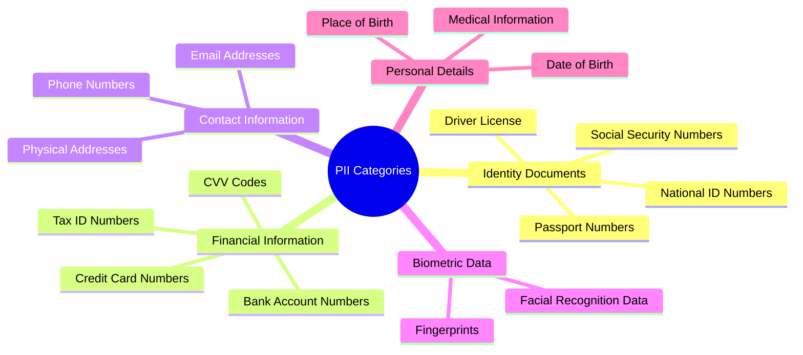
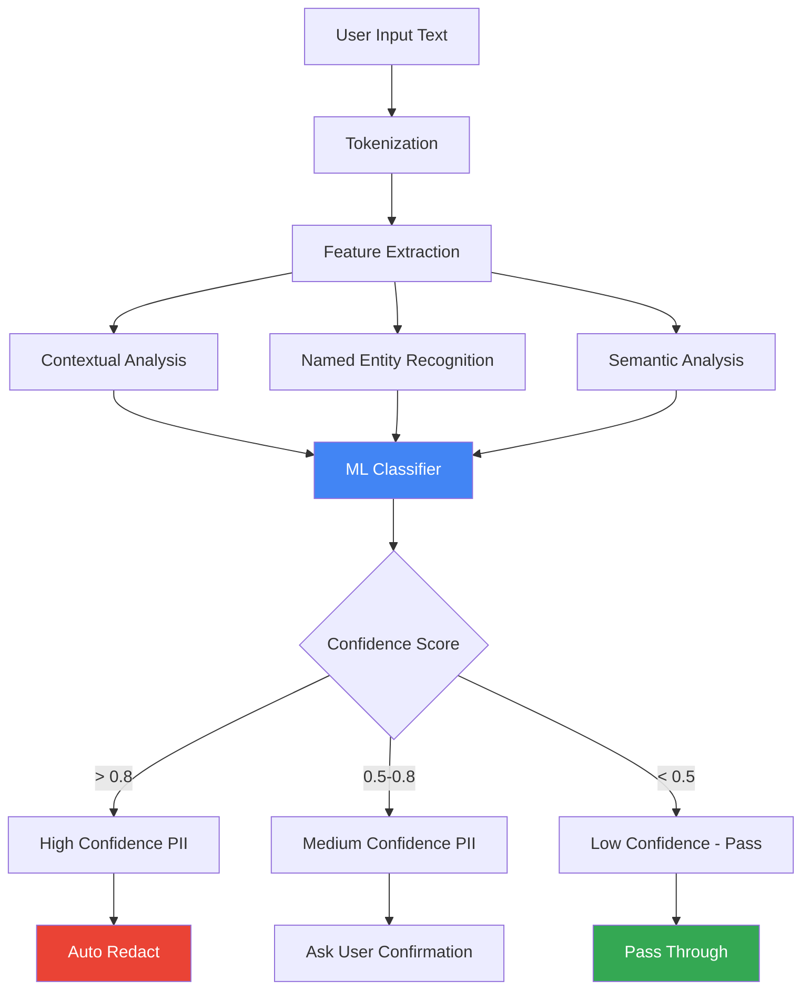
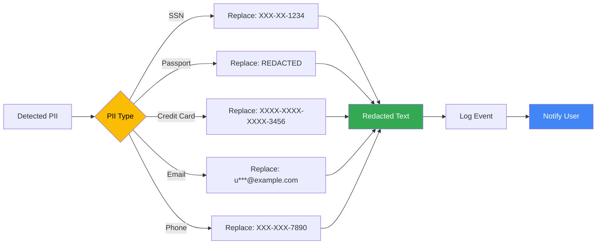
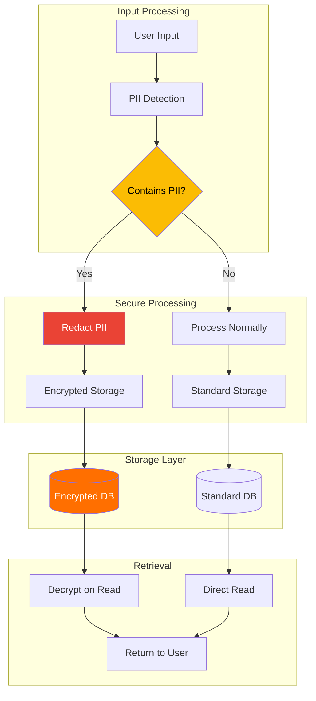
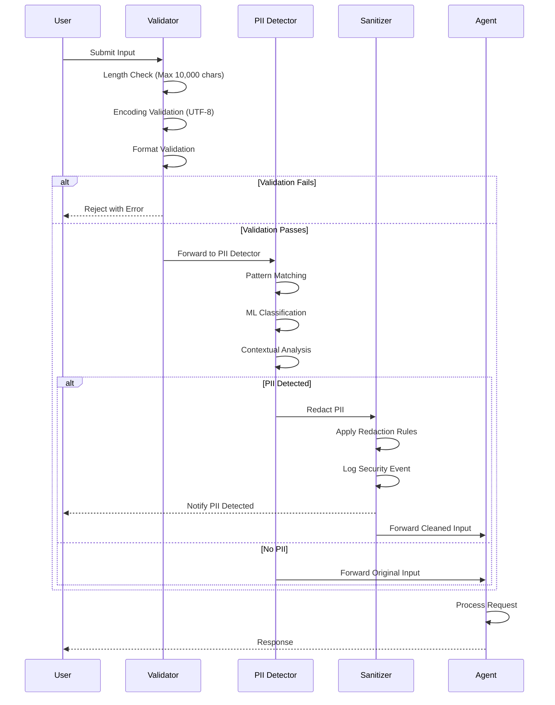
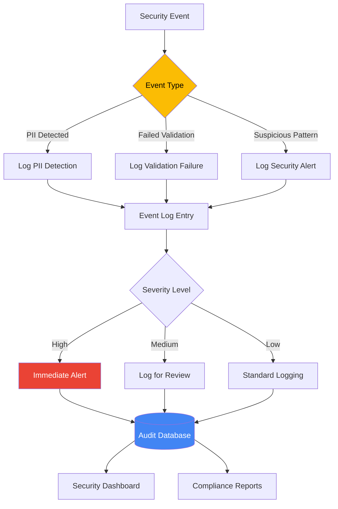
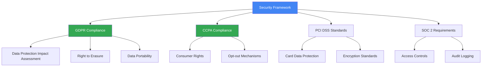
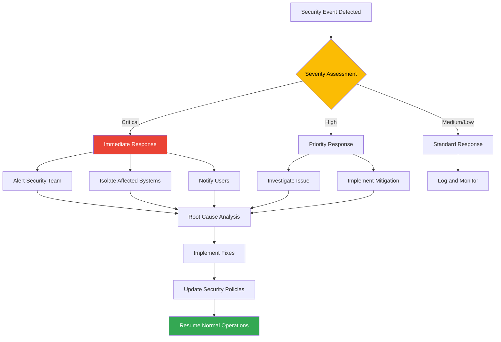

# Security and PII Protection Framework

## Overview

The AI-Powered Vacation Planner implements a comprehensive security framework with a focus on Personally Identifiable Information (PII) protection. This document outlines the security architecture, PII detection mechanisms, and data protection strategies.

---

## Table of Contents

1. [Security Principles](#security-principles)
2. [PII Detection Architecture](#pii-detection-architecture)
3. [Data Protection Mechanisms](#data-protection-mechanisms)
4. [Security Guardrails](#security-guardrails)
5. [Implementation Details](#implementation-details)
6. [Compliance and Standards](#compliance-and-standards)

---

## Security Principles

### Core Security Tenets

1. **Privacy by Design**: Security and privacy are built into the system from the ground up
2. **Defense in Depth**: Multiple layers of security controls
3. **Least Privilege**: Agents and tools have minimum necessary permissions
4. **Data Minimization**: Collect and store only essential information
5. **Transparency**: Users are informed about data collection and processing
6. **User Control**: Users can review and delete their data

---

## PII Detection Architecture

### Sensitive Information Categories



### Detection Methods

#### 1. Pattern-Based Detection (Regex)

**Social Security Number (SSN)**
```regex
Pattern: \b\d{3}-\d{2}-\d{4}\b|\b\d{9}\b
Examples: 123-45-6789, 123456789
Confidence: 95%
```

**Passport Numbers**
```regex
Pattern: [A-Z]{1,2}\d{6,9}
Examples: A12345678, AB1234567
Confidence: 85%
```

**Credit Card Numbers**
```regex
Pattern: \b(?:\d{4}[-\s]?){3}\d{4}\b
Examples: 1234-5678-9012-3456, 1234567890123456
Confidence: 90%
```

**Email Addresses**
```regex
Pattern: [a-zA-Z0-9._%+-]+@[a-zA-Z0-9.-]+\.[a-zA-Z]{2,}
Examples: user@example.com
Confidence: 99%
```

**Phone Numbers**
```regex
Pattern: \+?1?\s*\(?[0-9]{3}\)?[-.\s]?[0-9]{3}[-.\s]?[0-9]{4}
Examples: (123) 456-7890, +1-123-456-7890
Confidence: 85%
```

#### 2. Machine Learning-Based Detection



#### 3. Contextual Detection

Analyzes surrounding text to identify PII based on context:

```
Examples:
- "My passport is ABC123456" → Detected via context
- "SSN: 123-45-6789" → Detected via pattern + context
- "Call me at 555-1234" → Detected via context
```

---

## Data Protection Mechanisms

### Redaction Strategy



### Encryption and Storage



---

## Security Guardrails

### Input Validation Pipeline



### Security Event Logging



---

## Implementation Details

### Security Guardian Agent Implementation

```python
class SecurityGuardianAgent:
    """
    Security Guardian Agent responsible for PII detection and protection
    """

    def __init__(self):
        self.pii_patterns = self._load_pii_patterns()
        self.ml_classifier = self._load_ml_model()
        self.audit_logger = AuditLogger()

    def validate_input(self, user_input: str) -> ValidationResult:
        """
        Validates and sanitizes user input
        """
        # Step 1: Basic validation
        if not self._validate_length(user_input):
            return ValidationResult(valid=False, error="Input too long")

        if not self._validate_encoding(user_input):
            return ValidationResult(valid=False, error="Invalid encoding")

        # Step 2: PII Detection
        pii_findings = self.detect_pii(user_input)

        # Step 3: Redaction if needed
        if pii_findings:
            cleaned_input = self._redact_pii(user_input, pii_findings)
            self.audit_logger.log_pii_detection(pii_findings)
            return ValidationResult(
                valid=True,
                cleaned_input=cleaned_input,
                pii_detected=True,
                findings=pii_findings
            )

        return ValidationResult(valid=True, cleaned_input=user_input)

    def detect_pii(self, text: str) -> List[PIIFinding]:
        """
        Multi-method PII detection
        """
        findings = []

        # Pattern-based detection
        pattern_findings = self._pattern_detection(text)
        findings.extend(pattern_findings)

        # ML-based detection
        ml_findings = self._ml_detection(text)
        findings.extend(ml_findings)

        # Contextual detection
        context_findings = self._contextual_detection(text)
        findings.extend(context_findings)

        # Deduplicate and score
        return self._consolidate_findings(findings)

    def _pattern_detection(self, text: str) -> List[PIIFinding]:
        """
        Regex-based PII detection
        """
        findings = []

        for pii_type, pattern in self.pii_patterns.items():
            matches = re.finditer(pattern, text)
            for match in matches:
                findings.append(PIIFinding(
                    pii_type=pii_type,
                    start=match.start(),
                    end=match.end(),
                    text=match.group(),
                    confidence=0.95,
                    method="pattern"
                ))

        return findings

    def _ml_detection(self, text: str) -> List[PIIFinding]:
        """
        Machine learning-based PII detection
        """
        # Tokenize and extract features
        tokens = self._tokenize(text)
        features = self._extract_features(tokens)

        # Classify
        predictions = self.ml_classifier.predict(features)

        findings = []
        for token, prediction in zip(tokens, predictions):
            if prediction.confidence > 0.5:
                findings.append(PIIFinding(
                    pii_type=prediction.pii_type,
                    start=token.start,
                    end=token.end,
                    text=token.text,
                    confidence=prediction.confidence,
                    method="ml"
                ))

        return findings

    def _contextual_detection(self, text: str) -> List[PIIFinding]:
        """
        Context-aware PII detection
        """
        findings = []

        # Look for PII indicators
        indicators = [
            "passport", "ssn", "social security",
            "credit card", "phone", "email"
        ]

        for indicator in indicators:
            if indicator in text.lower():
                # Extract nearby content
                context = self._extract_context(text, indicator)
                # Analyze for PII
                pii = self._analyze_context(context, indicator)
                if pii:
                    findings.extend(pii)

        return findings

    def _redact_pii(self, text: str, findings: List[PIIFinding]) -> str:
        """
        Redacts detected PII from text
        """
        # Sort findings by position (reverse order for safe replacement)
        sorted_findings = sorted(findings, key=lambda x: x.start, reverse=True)

        redacted_text = text
        for finding in sorted_findings:
            replacement = self._get_replacement(finding)
            redacted_text = (
                redacted_text[:finding.start] +
                replacement +
                redacted_text[finding.end:]
            )

        return redacted_text

    def _get_replacement(self, finding: PIIFinding) -> str:
        """
        Generates appropriate replacement for PII type
        """
        replacements = {
            "ssn": "[SSN REDACTED]",
            "passport": "[PASSPORT REDACTED]",
            "credit_card": "[CREDIT CARD REDACTED]",
            "email": "[EMAIL REDACTED]",
            "phone": "[PHONE REDACTED]"
        }

        return replacements.get(finding.pii_type, "[REDACTED]")
```

### Tool Prompt Security Enhancement

```python
def create_secure_tool_prompt(agent_type: str, task: str, context: dict) -> str:
    """
    Creates a secure, well-crafted prompt for agent tools with PII protection
    """

    # Filter context for any remaining PII
    secure_context = security_guardian.validate_context(context)

    prompt = f"""
You are a specialized {agent_type} agent with expertise in vacation planning.

SECURITY GUIDELINES:
- NEVER request, store, or display sensitive personal information
- If you detect SSN, passport numbers, or credit card details, immediately stop and alert
- Validate all external data before processing
- Follow data minimization principles

CURRENT TASK:
{task}

USER CONTEXT:
Destination: {secure_context.get('destination')}
Travel Dates: {secure_context.get('dates')}
Origin: {secure_context.get('origin')}
Preferences: {secure_context.get('preferences')}

INSTRUCTIONS:
{get_agent_instructions(agent_type)}

OUTPUT FORMAT:
{get_output_format(agent_type)}

IMPORTANT:
- Provide accurate, up-to-date information
- Explain your reasoning clearly
- Identify any limitations or assumptions
- If you need additional information, ask specific questions
- Prioritize user safety and security

Begin your analysis:
"""

    return prompt
```

---

## Compliance and Standards

### Regulatory Compliance



### Data Retention Policy

| Data Type | Retention Period | Deletion Method |
|-----------|-----------------|-----------------|
| Session Data | 24 hours | Automatic deletion |
| User Preferences | Until user deletion request | Secure erasure |
| Audit Logs | 90 days | Archived then deleted |
| PII Detection Logs | 30 days | Secure deletion |
| Generated Itineraries | 30 days or user deletion | Secure erasure |

### User Rights

1. **Right to Access**: Users can request all stored data
2. **Right to Deletion**: Users can delete all their data
3. **Right to Rectification**: Users can correct their data
4. **Right to Data Portability**: Users can export their data
5. **Right to Object**: Users can opt-out of data processing

---

## Security Testing

### PII Detection Test Cases

```python
test_cases = [
    {
        "input": "My SSN is 123-45-6789",
        "expected_redaction": "My SSN is [SSN REDACTED]",
        "pii_type": "ssn",
        "should_detect": True
    },
    {
        "input": "Passport: A12345678",
        "expected_redaction": "Passport: [PASSPORT REDACTED]",
        "pii_type": "passport",
        "should_detect": True
    },
    {
        "input": "Card number 1234-5678-9012-3456",
        "expected_redaction": "Card number [CREDIT CARD REDACTED]",
        "pii_type": "credit_card",
        "should_detect": True
    },
    {
        "input": "I want to visit Paris in June",
        "expected_redaction": "I want to visit Paris in June",
        "pii_type": None,
        "should_detect": False
    }
]
```

### Security Audit Checklist

- [ ] PII detection accuracy > 95%
- [ ] False positive rate < 5%
- [ ] Redaction completeness = 100%
- [ ] Audit logging functional
- [ ] Encryption at rest enabled
- [ ] Encryption in transit (TLS 1.3)
- [ ] Access controls configured
- [ ] User notification system operational
- [ ] Data deletion procedures tested
- [ ] Compliance documentation complete

---

## Incident Response



---

## Best Practices

### For Developers

1. **Never log PII** - Even in debug mode
2. **Use secure defaults** - Security should be opt-out, not opt-in
3. **Validate all inputs** - Never trust user input
4. **Minimize data collection** - Only collect what's necessary
5. **Regular security reviews** - Schedule periodic audits
6. **Keep dependencies updated** - Patch vulnerabilities promptly

### For Users

1. **Avoid sharing sensitive information** - The system will redact, but better to avoid
2. **Review generated documents** - Check for any accidentally included sensitive data
3. **Use strong authentication** - If the system has user accounts
4. **Report security concerns** - Help us improve security
5. **Understand data retention** - Know how long your data is stored

---

## Conclusion

The security and PII protection framework ensures that the AI-Powered Vacation Planner operates with the highest standards of data protection. Through multi-layered detection, proactive redaction, comprehensive audit logging, and adherence to regulatory standards, we provide users with a secure and trustworthy vacation planning experience.
